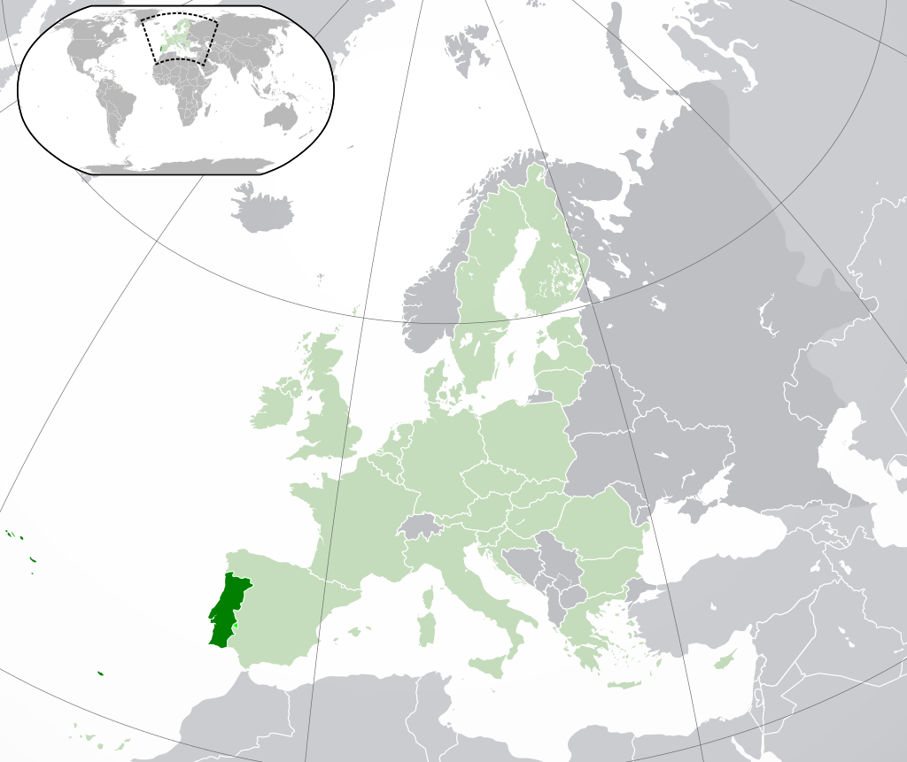

```{r setup, include=FALSE}
knitr::opts_chunk$set(echo = TRUE)
library(tidyverse)
```

## Introduction

In this project, we explore a selected dataset on forest fires. You can download
the `forestfire.csv` file [here](https://archive.ics.uci.edu/ml/machine-learning-databases/forest-fires/).

Forest fires can create ecological problems and endanger human lives and property. Understanding when they occur and what causes them is important for managing them. The data we are working with is
associated with a [scientific research paper](http://www3.dsi.uminho.pt/pcortez/fires.pdf) on predicting the occurrence of forest fires in Portugal using modeling techniques.




We will not use any type of modeling, but rather we'll focus on visualizing. Though, we'll perform exploratory analyses on the data to better understand it and any relationships that might be present in it.

To get started, we import the `forestfire.csv` file into R as a tibble:

```{r}
forest_fires <- read_csv("sources/forestfires.csv",show_col_types = FALSE)

print(dim(forest_fires))

head(forest_fires)
```

From the preview of the dataset, we can see that it has 517 rows and 13 columns.

Here are description of the variables in the dataset and the range of values for each taken from the paper:

- **X:** X-axis spatial coordinate within the Montesinho park map: 1 to 9
- **Y:** Y-axis spatial coordinate within the Montesinho park map: 2 to 9
- **month:** Month of the year: 'jan' to 'dec'
- **day:** Day of the week: 'mon' to 'sun'
- **FFMC:** Fine Fuel Moisture Code index from the FWI system: 18.7 to 96.20
- **DMC:** Duff Moisture Code index from the FWI system: 1.1 to 291.3
- **DC:** Drought Code index from the FWI system: 7.9 to 860.6 
- **ISI:** Initial Spread Index from the FWI system: 0.0 to 56.10
- **temp:** Temperature in Celsius degrees: 2.2 to 33.30
- **RH:** Relative humidity in percentage: 15.0 to 100
- **wind:** Wind speed in km/h: 0.40 to 9.40
- **rain:** Outside rain in mm/m2 : 0.0 to 6.4
- **area:** The burned area of the forest (in ha): 0.00 to 1090.84

The acronym `FWI` stands for "[fire weather index](https://en.wikipedia.org/wiki/Forest_fire_weather_index)", a method used by scientists to qualify risk factors for forest fires. You can read more about the FWI system and the variables included in this data set [here](http://cwfis.cfs.nrcan.gc.ca/background/summary/fwi) if you'd like.

---

## Data Processing

When we take a look at the `month` and `day` variables, we get the following result:

```{r}
forest_fires %>% pull(month) %>% unique()
forest_fires %>% pull(day) %>% unique()
```

We know that these variables have an inherent order. If we were to  just use these variables as is, then R would automatically sort them by alphabetical order. To enforce the inherent order on the data itself, we convert them to categorical variables:

```{r}
month_levels <- c("jan","feb","mar","apr","may","jun","jul","aug","sep","oct","nov","dec")
day_levels <- c("mon","tue","wed","thu","fri","sat","sun")

forest_fires <- forest_fires %>%
  mutate(
    month = factor(month,levels = month_levels),
    day = factor(day,levels = day_levels)
  )

head(forest_fires)
```


---

## When Do Most Forest Fires Occur?

When it comes to understanding forest fires and what can be done to manage them, it is helpful to have an idea of **when** the fires are most likely to occur. For example, there is a notion of a *fire season* in the state of California in the United States between May and October, thanks to the summer heat.

We've seen two variables concerning time: `month` and `day`. These two columns allow us to ask:

- Which months do forest fires happen the most?
- Which days of the week do forest fires happen the most?

The problem is that the data in its current form describes individual fires. It would be easier to plot the data if it is grouped up by month or day of the year. Thus, we create a tibble that counts the number of forest fires by month:

```{r}
fires_by_month <- forest_fires %>% group_by(month) %>% summarize(fires=n())

knitr::kable(fires_by_month,caption="Fires per Month")
```

as well as, a tibble that counts the number of forest fires by day of the week:

```{r}
fires_by_wday <- forest_fires %>% group_by(day) %>% summarize(fires=n())

knitr::kable(fires_by_wday,caption="Fires per days of the week")
```

With these tibbles, we can create a visualization that allows us to easily see when most forest fires do occur:

#### Fires by Month

```{r Histogram_Number _of_Forest_Fires_per_Month}
fires_by_month %>% 
  ggplot(aes(x=month,y=fires))+
  geom_col()+
  labs(
    title="Number of Forest Fires per Month",
    x = "Month",
    y = "Number of Forest Fires"
  )
```

This suggests, that the *fire season* in Portugal is from **August** to **September**.


#### Fires per Day of Week

```{r Histogram_Number_of_Forest_Fires_per_Day_of_Week}
fires_by_wday %>% 
  ggplot(aes(x=day,y=fires))+
  geom_col()+
  labs(
    title="Number of Forest Fires per Day of Week",
    x = "Day of Week",
    y = "Number of Forest Fires"
  )
```

It looks like the day of the week with a higher frequency of forest fires are **Friday**, **Saturday** and **Sunday** -  the days of the weekend. The day of the week with the lowest number of forest fires is **Wednesday**.

---

## Plotting Other Variables Against Time

From our graphs, we saw that August and September see more forest fires than other months. It also looks as though the weekend days (Friday, Saturday, and Sunday) have more forest fires than days in the middle of the week.

To explore the temporal patterns of forest fire occurrence the bar charts reveal, we should look more closely at how the variables that relate to forest fires vary by month and by day of the week. We should see how each of the other variables in the dataset relates to `month`. We'll exclude day for now since it's really the months that can vary a lot between seasons.

We have the following other variables:

- `FFMC`
- `DMC`
- `DC`
- `ISI`
- `temp`
- `RH`
- `wind`
- `rain``

Let's create some visualizations that look at the relationship between `month` and each of the columns above. Because for now, we only want to observe if any of the variables have values that stand out during August and September, which we've previously confirmed sees a lot of fires, we will normalize each variable to its absolute maximum value and calculate its mean for each month. This makes it easier to plot them in one graph:

```{r Scatter_Plotts_Normalized_Means_Against_Time, fig.height=15, fig.width=8}
forest_fires_normalized <- forest_fires %>% mutate(
  FFMC = FFMC/max(abs(FFMC)),
  DMC = DMC/max(abs(DMC)),
  DC = DC/max(abs(DC)),
  ISI = ISI/max(abs(ISI)),
  temp = temp/max(abs(temp)),
  RH = RH/max(abs(RH)),
  wind = wind/max(abs(wind)),
  rain = rain/max(abs(rain))
)

mormalized_means <- forest_fires_normalized %>%
  group_by(month) %>% 
  summarize(
    FFMC_means=mean(FFMC),
    DMC_means = mean(DMC),
    DC_means = mean(DC),
    ISI_means = mean(ISI),
    temp_means = mean(temp),
    RH_means = mean(RH),
    wind_means = mean(wind),
    rain_means = mean(rain)
    )


mormalized_means %>% pivot_longer(
  cols = c(FFMC_means,DMC_means,DC_means,ISI_means,temp_means,RH_means,wind_means,rain_means),
  names_to = "variables",
  values_to = "means"
  ) %>%
    ggplot(aes(x=month,y=means,color=variables))+
    geom_vline(aes(xintercept="aug"),alpha=0.8)+
    geom_vline(aes(xintercept="sep"),alpha=0.8)+
    geom_point(size=3)+
    facet_grid(rows = vars(variables))+
    ylab("normalzed means")+
    labs(title="Normalized Means Against Months")
```

For each variable, the months **August** and **September** are highlighted with a vertical black line as a guide to the eye. The variables that seem to correlate with the increased number of forest fires in these two months seem to be:

- **DC**
- **DMC**
- **temp**

---

## Examining Forest Fire Severety


