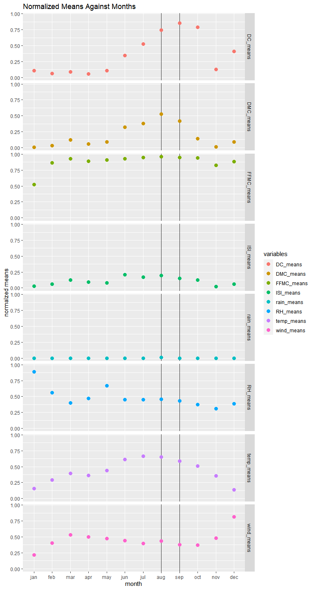

Analyzing Forest Fire Data
================
Bastian Hartmann
27 Januar 2022

## Introduction

In this project, we explore a selected dataset on forest fires. You can
download the `forestfire.csv` file
[here](https://archive.ics.uci.edu/ml/machine-learning-databases/forest-fires/).

Forest fires can create ecological problems and endanger human lives and
property. Understanding when they occur and what causes them is
important for managing them. The data we are working with is associated
with a [scientific research
paper](http://www3.dsi.uminho.pt/pcortez/fires.pdf) on predicting the
occurrence of forest fires in Portugal using modeling techniques.


We will not use any type of modeling, but rather we’ll focus on
visualizing. Though, we’ll perform exploratory analyses on the data to
better understand it and any relationships that might be present in it.

To get started, we import the `forestfire.csv` file into R as a tibble:

``` r
forest_fires <- read_csv("sources/forestfires.csv",show_col_types = FALSE)

print(dim(forest_fires))
```

    ## [1] 517  13

``` r
head(forest_fires)
```

    ## # A tibble: 6 x 13
    ##       X     Y month day    FFMC   DMC    DC   ISI  temp    RH  wind  rain  area
    ##   <dbl> <dbl> <chr> <chr> <dbl> <dbl> <dbl> <dbl> <dbl> <dbl> <dbl> <dbl> <dbl>
    ## 1     7     5 mar   fri    86.2  26.2  94.3   5.1   8.2    51   6.7   0       0
    ## 2     7     4 oct   tue    90.6  35.4 669.    6.7  18      33   0.9   0       0
    ## 3     7     4 oct   sat    90.6  43.7 687.    6.7  14.6    33   1.3   0       0
    ## 4     8     6 mar   fri    91.7  33.3  77.5   9     8.3    97   4     0.2     0
    ## 5     8     6 mar   sun    89.3  51.3 102.    9.6  11.4    99   1.8   0       0
    ## 6     8     6 aug   sun    92.3  85.3 488    14.7  22.2    29   5.4   0       0

From the preview of the dataset, we can see that it has 517 rows and 13
columns.

Here are description of the variables in the dataset and the range of
values for each taken from the paper:

-   **X:** X-axis spatial coordinate within the Montesinho park map: 1
    to 9
-   **Y:** Y-axis spatial coordinate within the Montesinho park map: 2
    to 9
-   **month:** Month of the year: ‘jan’ to ‘dec’
-   **day:** Day of the week: ‘mon’ to ‘sun’
-   **FFMC:** Fine Fuel Moisture Code index from the FWI system: 18.7 to
    96.20
-   **DMC:** Duff Moisture Code index from the FWI system: 1.1 to 291.3
-   **DC:** Drought Code index from the FWI system: 7.9 to 860.6
-   **ISI:** Initial Spread Index from the FWI system: 0.0 to 56.10
-   **temp:** Temperature in Celsius degrees: 2.2 to 33.30
-   **RH:** Relative humidity in percentage: 15.0 to 100
-   **wind:** Wind speed in km/h: 0.40 to 9.40
-   **rain:** Outside rain in mm/m2 : 0.0 to 6.4
-   **area:** The burned area of the forest (in ha): 0.00 to 1090.84

The acronym `FWI` stands for “[fire weather
index](https://en.wikipedia.org/wiki/Forest_fire_weather_index)”, a
method used by scientists to qualify risk factors for forest fires. You
can read more about the FWI system and the variables included in this
data set [here](http://cwfis.cfs.nrcan.gc.ca/background/summary/fwi) if
you’d like.

------------------------------------------------------------------------

## Data Processing

When we take a look at the `month` and `day` variables, we get the
following result:

``` r
forest_fires %>% pull(month) %>% unique()
```

    ##  [1] "mar" "oct" "aug" "sep" "apr" "jun" "jul" "feb" "jan" "dec" "may" "nov"

``` r
forest_fires %>% pull(day) %>% unique()
```

    ## [1] "fri" "tue" "sat" "sun" "mon" "wed" "thu"

We know that these variables have an inherent order. If we were to just
use these variables as is, then R would automatically sort them by
alphabetical order. To enforce the inherent order on the data itself, we
convert them to categorical variables:

``` r
month_levels <- c("jan","feb","mar","apr","may","jun","jul","aug","sep","oct","nov","dec")
day_levels <- c("mon","tue","wed","thu","fri","sat","sun")

forest_fires <- forest_fires %>%
  mutate(
    month = factor(month,levels = month_levels),
    day = factor(day,levels = day_levels)
  )

head(forest_fires)
```

    ## # A tibble: 6 x 13
    ##       X     Y month day    FFMC   DMC    DC   ISI  temp    RH  wind  rain  area
    ##   <dbl> <dbl> <fct> <fct> <dbl> <dbl> <dbl> <dbl> <dbl> <dbl> <dbl> <dbl> <dbl>
    ## 1     7     5 mar   fri    86.2  26.2  94.3   5.1   8.2    51   6.7   0       0
    ## 2     7     4 oct   tue    90.6  35.4 669.    6.7  18      33   0.9   0       0
    ## 3     7     4 oct   sat    90.6  43.7 687.    6.7  14.6    33   1.3   0       0
    ## 4     8     6 mar   fri    91.7  33.3  77.5   9     8.3    97   4     0.2     0
    ## 5     8     6 mar   sun    89.3  51.3 102.    9.6  11.4    99   1.8   0       0
    ## 6     8     6 aug   sun    92.3  85.3 488    14.7  22.2    29   5.4   0       0

------------------------------------------------------------------------

## When Do Most Forest Fires Occur?

When it comes to understanding forest fires and what can be done to
manage them, it is helpful to have an idea of **when** the fires are
most likely to occur. For example, there is a notion of a *fire season*
in the state of California in the United States between May and October,
thanks to the summer heat.

We’ve seen two variables concerning time: `month` and `day`. These two
columns allow us to ask:

-   Which months do forest fires happen the most?
-   Which days of the week do forest fires happen the most?

The problem is that the data in its current form describes individual
fires. It would be easier to plot the data if it is grouped up by month
or day of the year. Thus, we create a tibble that counts the number of
forest fires by month:

``` r
fires_by_month <- forest_fires %>% group_by(month) %>% summarize(fires=n())

knitr::kable(fires_by_month,caption="Fires per Month")
```

| month | fires |
|:------|------:|
| jan   |     2 |
| feb   |    20 |
| mar   |    54 |
| apr   |     9 |
| may   |     2 |
| jun   |    17 |
| jul   |    32 |
| aug   |   184 |
| sep   |   172 |
| oct   |    15 |
| nov   |     1 |
| dec   |     9 |

Fires per Month

as well as, a tibble that counts the number of forest fires by day of
the week:

``` r
fires_by_wday <- forest_fires %>% group_by(day) %>% summarize(fires=n())

knitr::kable(fires_by_wday,caption="Fires per days of the week")
```

| day | fires |
|:----|------:|
| mon |    74 |
| tue |    64 |
| wed |    54 |
| thu |    61 |
| fri |    85 |
| sat |    84 |
| sun |    95 |

Fires per days of the week

With these tibbles, we can create a visualization that allows us to
easily see when most forest fires do occur:

#### Fires by Month

``` r
fires_by_month %>% 
  ggplot(aes(x=month,y=fires))+
  geom_col()+
  labs(
    title="Number of Forest Fires per Month",
    x = "Month",
    y = "Number of Forest Fires"
  )
```

<!-- -->

This suggests, that the *fire season* in Portugal is from **August** to
**September**.

#### Fires per Day of Week

``` r
fires_by_wday %>% 
  ggplot(aes(x=day,y=fires))+
  geom_col()+
  labs(
    title="Number of Forest Fires per Day of Week",
    x = "Day of Week",
    y = "Number of Forest Fires"
  )
```

<!-- -->

It looks like the day of the week with a higher frequency of forest
fires are **Friday**, **Saturday** and **Sunday** - the days of the
weekend. The day of the week with the lowest number of forest fires is
**Wednesday**.

------------------------------------------------------------------------

## Plotting Other Variables Against Time

From our graphs, we saw that August and September see more forest fires
than other months. It also looks as though the weekend days (Friday,
Saturday, and Sunday) have more forest fires than days in the middle of
the week.

To explore the temporal patterns of forest fire occurrence the bar
charts reveal, we should look more closely at how the variables that
relate to forest fires vary by month and by day of the week. We should
see how each of the other variables in the dataset relates to `month`.
We’ll exclude day for now since it’s really the months that can vary a
lot between seasons.

We have the following other variables:

-   `FFMC`
-   `DMC`
-   `DC`
-   `ISI`
-   `temp`
-   `RH`
-   `wind`
-   `rain`

Let’s create some visualizations that look at the relationship between
`month` and each of the columns above. Because for now, we only want to
observe if any of the variables have values that stand out during August
and September, which we’ve previously confirmed sees a lot of fires, we
will normalize each variable to its absolute maximum value and calculate
its mean for each month. This makes it easier to plot them in one graph:

``` r
forest_fires_normalized <- forest_fires %>% mutate(
  FFMC = FFMC/max(abs(FFMC)),
  DMC = DMC/max(abs(DMC)),
  DC = DC/max(abs(DC)),
  ISI = ISI/max(abs(ISI)),
  temp = temp/max(abs(temp)),
  RH = RH/max(abs(RH)),
  wind = wind/max(abs(wind)),
  rain = rain/max(abs(rain))
)

mormalized_means <- forest_fires_normalized %>%
  group_by(month) %>% 
  summarize(
    FFMC_means=mean(FFMC),
    DMC_means = mean(DMC),
    DC_means = mean(DC),
    ISI_means = mean(ISI),
    temp_means = mean(temp),
    RH_means = mean(RH),
    wind_means = mean(wind),
    rain_means = mean(rain)
    )


mormalized_means %>% pivot_longer(
  cols = c(FFMC_means,DMC_means,DC_means,ISI_means,temp_means,RH_means,wind_means,rain_means),
  names_to = "variables",
  values_to = "means"
  ) %>%
    ggplot(aes(x=month,y=means,color=variables))+
    geom_vline(aes(xintercept="aug"),alpha=0.8)+
    geom_vline(aes(xintercept="sep"),alpha=0.8)+
    geom_point(size=3)+
    facet_grid(rows = vars(variables))+
    ylab("normalzed means")+
    labs(title="Normalized Means Against Months")
```

<!-- -->

For each variable, the months **August** and **September** are
highlighted with a vertical black line as a guide to the eye. The
variables that seem to correlate with the increased number of forest
fires in these two months seem to be:

-   **DC**
-   **DMC**
-   **temp**

------------------------------------------------------------------------

## Examining Forest Fire Severety

Let’s investigate further! So far, we’ve only looked at the relationship
between the variables in the data and the *frequency* of forest fires.
Fires can also range in intensity too, so it might be useful to know
what factors influence this as well. In this data set, the `area`
variable contains data on the number of hectares of forest that burned
during the forest fire. We’ll use this variable as an indicator of the
severity of the fire.

The idea behind using `area` as a proxy is that worse fires will result
in a larger burned area. Of course, this won’t be true in all cases, but
it is a reasonable assumption to make.

First, we create scatter plots to see what can be learned about
relationships between the area burned by a forest fire and the following
variables:

-   **FFMC:** Fine Fuel Moisture Code index from the FWI system: 18.7 to
    96.20
-   **DMC:** Duff Moisture Code index from the FWI system: 1.1 to 291.3
-   **DC:** Drought Code index from the FWI system: 7.9 to 860.6
-   **ISI:** Initial Spread Index from the FWI system: 0.0 to 56.10
-   **temp:** Temperature in Celsius degrees: 2.2 to 33.30
-   **RH:** Relative humidity in percentage: 15.0 to 100
-   **wind:** Wind speed in km/h: 0.40 to 9.40
-   **rain:** Outside rain in mm/m2 : 0.0 to 6.4

In this case, we’re interested in whether the variables above may
*affect* forest fire area. For that reason, we place `area` on the
y-axes and the other variables on the x-axes of your scatter plots.

``` r
forest_fires %>%
  pivot_longer(
    cols = c("FFMC","DMC","DC","ISI","temp","RH","wind","rain"),
    names_to = "variables",
    values_to = "var_vals"
  ) %>%
    ggplot(aes(x=var_vals,y=area))+
    geom_point(size=3)+
    facet_wrap(facets = vars(variables),
               scales = "free_x")
```

<!-- -->

From the scatter plots we see it’s hard to understand any relationships
between the variables due to a few high outliers of the `area` values,
and many values of `area` that are zero or close to zero.

The following histogram of the `area` values clearly illustrates why the
scatter plots look the way they do:

``` r
forest_fires %>%
  ggplot(aes(x=area))+
  geom_histogram(bins=30)
```

<!-- -->

------------------------------------------------------------------------

## Outlier Problems

There are outliers in the area column, which represent fires that caused
inordinate amounts of damage compared to the other fires in the data. To
more clearly visualize relationships between variables, we first have to
do some filtering on the `area` values bevore plotting the scatter plots
again. More precisely, we will:

-   except rows with zero values of `area`
-   except rows with values of `area` higher than 600

``` r
quants = quantile(forest_fires[["area"]])
quant_25 = quants[2]
quant_75 = quants[4]
filtered_forest_fires <- forest_fires %>%
  filter(
    area != 0 &
    #(area < quant_25-(1.5*IQR(area)) | (area > quant_75+(1.5*IQR(area))))
    area < 600
  )

filtered_forest_fires %>%
  pivot_longer(
    cols = c("FFMC","DMC","DC","ISI","temp","RH","wind","rain"),
    names_to = "variables",
    values_to = "var_vals"
  ) %>%
    ggplot(aes(x=var_vals,y=area))+
    geom_point(size=3)+
    facet_wrap(facets = vars(variables),
               scales = "free_x"
    )
```

<!-- -->

Based on the above scatter plotts, it seems that **DC**, **FFMC** and
**temp** could have a *positive* correlation on the severity of forest
fires. Whereas, **wind**, **RH** and **ISI** could have a *negative*
correlation on the severity of forest fires.
