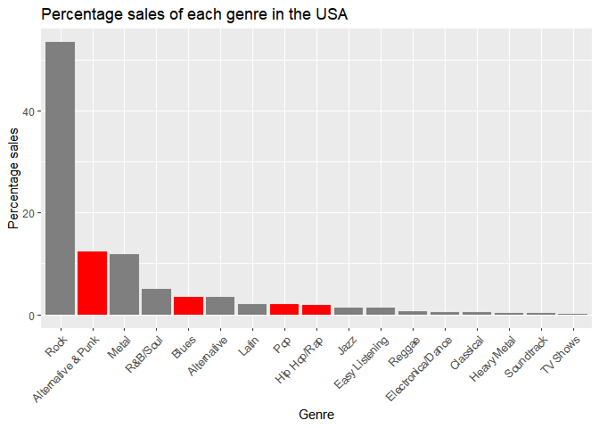
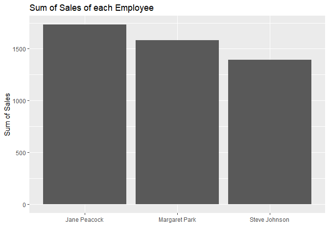
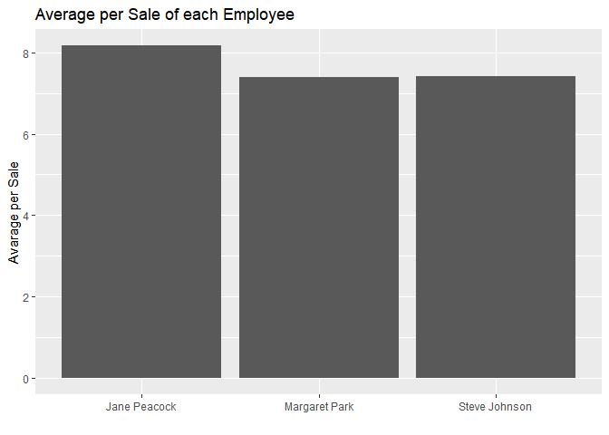
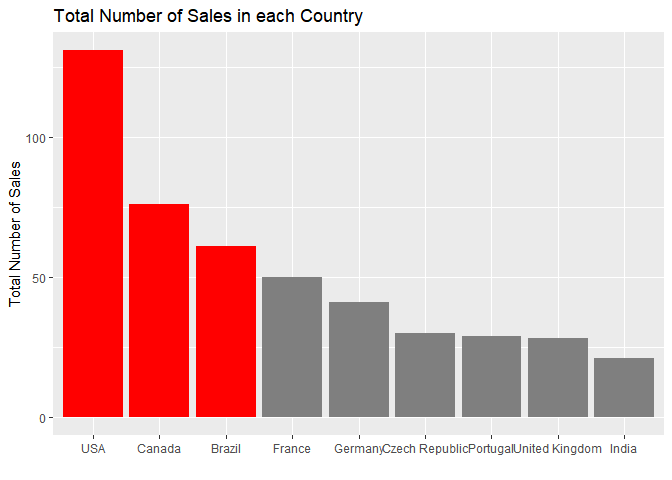
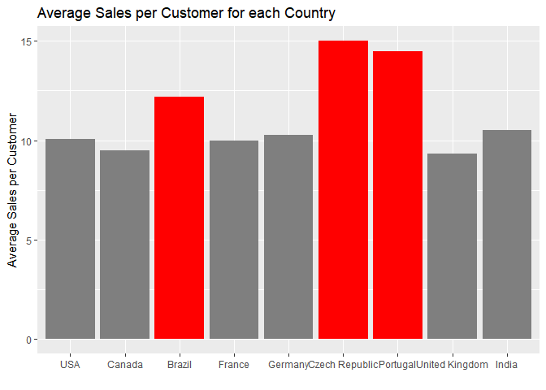
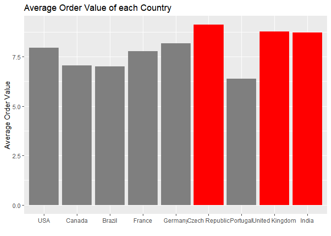

Answering Business Questions using SQL
================
Bastian Hartmann
2 March 2022

Before we start working with the `chinook` database (which can be
downloaded
[here](https://dsserver-prod-resources-1.s3.amazonaws.com/374/chinook.db))
to answer some business questions, we create two helper functions
(`run_query` and `show_tables`) that will make our life easier:

``` r
run_query <- function(db,query) {
  conn <- dbConnect(SQLite(),db)
  result <- dbGetQuery(conn,query)
  dbDisconnect(conn)
  return(result)
}

show_tables <- function(db) {
  q <- "SELECT
            name,
            type
          FROM sqlite_master
         WHERE type IN (\"table\",\"view\");"
  
  out_list <- run_query(db,q)
  return(out_list)
}

knitr::kable(show_tables(db))
```

| name           | type  |
|:---------------|:------|
| album          | table |
| artist         | table |
| customer       | table |
| employee       | table |
| genre          | table |
| invoice        | table |
| invoice_line   | table |
| media_type     | table |
| playlist       | table |
| playlist_track | table |
| track          | table |

------------------------------------------------------------------------

### Selecting Albums to Purchase

With the help of this database we want to tackle the following task:

The Chinook record store has just signed a deal with a new record label,
and we’re in charge of choosing the first three albums to be added to
the store. There are four albums to choose from, and all four are by
artists who don’t have any tracks in the store right now. Below is the
list of artist names and the genre of music they produce:

|          Artist Name |   Genre |
|---------------------:|--------:|
|                Regal | Hip-Hop |
|             Red Tone |    Punk |
| Meteor And the Girls |     Pop |
|       Slim Jim Bites |   Blues |

The record label specializes in artists from the USA, and they have
given Chinook some money to advertise the new albums in the USA. To aid
in selecting albums, we’re interested in finding out which genres sell
the best in the USA.

Put together, we use the `chinook` database to analyze:

**which genres sell the most tracks in the USA**

So let’s write a query that will return us each genre with the number of
tracks sold in the USA: \* in absolute numbers \* in percentages

``` r
q <- "
WITH tracks_genre_sold_usa AS (
SELECT
    ROW_NUMBER() OVER (
      ORDER BY il.invoice_line_id
    ) AS RowID,
    il.*,
    t.name track_name,
    g.name genre_name,
    c.country
  FROM invoice_line AS il
 INNER JOIN invoice inv ON inv.invoice_id = il.invoice_id
 INNER JOIN customer c ON c.customer_id = inv.customer_id
 INNER JOIN track t ON t.track_id = il.track_id
 INNER JOIN genre g ON g.genre_id = t.genre_id
 WHERE c.country = \"USA\"
)

SELECT 
    genre_name,
    COUNT(invoice_line_id) absolute_sold,
    CAST(COUNT(invoice_line_id) AS FLOAT)/(SELECT MAX(RowID) FROM tracks_genre_sold_usa) * 100.0 AS percentage_sold
  FROM tracks_genre_sold_usa
 GROUP BY 1
 ORDER BY 2 DESC;
"

genre_sales_usa <- run_query(db,q)

knitr::kable(genre_sales_usa)
```

| genre_name         | absolute_sold | percentage_sold |
|:-------------------|--------------:|----------------:|
| Rock               |           561 |      53.3777355 |
| Alternative & Punk |           130 |      12.3691722 |
| Metal              |           124 |      11.7982873 |
| R&B/Soul           |            53 |       5.0428164 |
| Blues              |            36 |       3.4253092 |
| Alternative        |            35 |       3.3301618 |
| Pop                |            22 |       2.0932445 |
| Latin              |            22 |       2.0932445 |
| Hip Hop/Rap        |            20 |       1.9029496 |
| Jazz               |            14 |       1.3320647 |
| Easy Listening     |            13 |       1.2369172 |
| Reggae             |             6 |       0.5708849 |
| Electronica/Dance  |             5 |       0.4757374 |
| Classical          |             4 |       0.3805899 |
| Heavy Metal        |             3 |       0.2854424 |
| Soundtrack         |             2 |       0.1902950 |
| TV Shows           |             1 |       0.0951475 |

To better visualize the data, we will also draw a bar plot of the
percentage genre sales with our genres of interest (Hip-Hop, Punk, Pop
and Blues) highlighted in red:

``` r
genre_sales_usa %>%
  ggplot(aes(x=reorder(genre_name,-percentage_sold), y=percentage_sold, fill = genre_name))+
  geom_bar(stat="identity",show.legend = FALSE)+
  labs(
    x = "Genre",
    y = "Percentage sales",
    title = "Percentage sales of each genre in the USA"
  )+
  theme(axis.text.x = element_text(angle = 45, vjust=1, hjust=1))+
  scale_fill_manual(name = "genre_name", values=c("Alternative & Punk"="red","Blues"="red","Pop"="red","Hip Hop/Rap"="red"))
```

<!-- -->

Among the genres represented in our list of 4 albums, punk, blues and
pop are the highest rated. Therefore, we should recommend:

-   Red Tone (Punk)
-   Slim Jim Bites (Blues)
-   Meteor and the Girls (Pop)

------------------------------------------------------------------------

### Analyzing Employee Sales Performance

Each customer for the Chinook store gets assigned to a sales support
agent within the company when they first make a purchase. We want to
analyze the purchases of customers belonging to each employee to see if
any sales support agent is performing either better or worse than the
others.

For this task we want to find **the total dollar amount of sales
assigned to each sales support agent within the company.**

``` r
q <- '
WITH cust_emp_inv AS (
  SELECT 
      em.employee_id,
      em.first_name||" "||em.last_name employee_name,
      em.hire_date,
      inv.total invoice_total
    FROM employee AS em
   INNER JOIN customer cu ON cu.support_rep_id = em.employee_id
   INNER JOIN invoice inv ON inv.customer_id = cu.customer_id
   WHERE em.title = "Sales Support Agent"
),
employee_performance AS (
SELECT 
    employee_name,
    hire_date,
    SUM(invoice_total) total_sum,
    COUNT(*) num_of_sales
  FROM cust_emp_inv
 GROUP BY 1
 ORDER BY 3 DESC
)

SELECT
    ep.*,
    ep.total_sum/ep.num_of_sales avg_sum
  FROM employee_performance AS ep
'

employee_sales_performance  <- run_query(db,q)
knitr::kable(employee_sales_performance)
```

| employee_name | hire_date           | total_sum | num_of_sales |  avg_sum |
|:--------------|:--------------------|----------:|-------------:|---------:|
| Jane Peacock  | 2017-04-01 00:00:00 |   1731.51 |          212 | 8.167500 |
| Margaret Park | 2017-05-03 00:00:00 |   1584.00 |          214 | 7.401869 |
| Steve Johnson | 2017-10-17 00:00:00 |   1393.92 |          188 | 7.414468 |

Visualization of the sum of sales using a bar graph:

``` r
employee_sales_performance %>%
  ggplot(aes(x=employee_name,y=total_sum))+
  geom_bar(stat="identity")+
  labs(
    x = "",
    y = "Sum of Sales",
    title = "Sum of Sales of each Employee"
  )
```

<!-- -->

From this graph it seems that *Jane Peacock* was the best performing,
whereas *Steve Johnson* was the worst performing employee.

If we take a look at the hiring dates:

|      Employee | Hiring Date | Number of Sales |
|--------------:|------------:|----------------:|
|  Jane Peacock |  2017-04-01 |             212 |
| Margaret Park |  2017-05-03 |             214 |
| Steve Johnson |  2017-10-17 |             188 |

We can see, that *Steve Johnson* is the newest member of the employees
and thus had less time finishing sales. This could be a reasonable
explanation for the lower number of sales.

When we visualize the average sum per sale (total_sum/number_of_sales),
the picture shifts a little bit:

``` r
employee_sales_performance %>%
  ggplot(aes(x=employee_name,y=avg_sum))+
  geom_bar(stat="identity")+
  labs(
    x = "",
    y = "Avarage per Sale",
    title = "Average per Sale of each Employee"
  )
```

<!-- -->

Here we can see, that *Jane Peacock* is still the best performing
employee. But compared to *Margaret Park*, *Steve Johnson* did not so
bad (even slightly better) during his employment period at chinook.

------------------------------------------------------------------------

### Analyzing Sales by Country

Our next task is to \*\* analyze the sales data for customers from each
different country\*\*. For this task, we will use the country value form
the `customers` table, and ignore the country from the billing address
in the `invoice` table.

In particular, we will calculate data for each country on the:

-   Total number of customers
-   Total value of sales
-   Average value of sales per customer
-   Average order value

Because there are a number of countries with only one customer, we will
group these customers as “Other” in your analysis.

``` r
q <- '
WITH customer_data AS (
  SELECT
      cu.customer_id,
      cu.first_name||" "||cu.last_name customer_name,
      cu.country,
      inv.total invoice_amount
    FROM customer AS cu
   INNER JOIN invoice AS inv ON inv.customer_id = cu.customer_id
   ORDER BY 3
),

country_customer_count AS (
  SELECT 
      country,
      COUNT(customer_id) number_of_customers
    FROM ( SELECT * FROM customer_data GROUP BY customer_name)
   GROUP BY 1 ORDER BY 1
),

country_sales_and_customers AS (
  SELECT
      cd.country,
      cc.number_of_customers,
      COUNT(cd.invoice_amount) total_sales,
      SUM(cd.invoice_amount) total_amount
    FROM customer_data AS cd
   INNER JOIN country_customer_count AS cc ON cc.country = cd.country
   GROUP BY 1
),

country_statistics AS (
  SELECT
      *,
      total_sales/number_of_customers avg_sales_per_customer,
      total_amount/total_sales avg_order_value
    FROM country_sales_and_customers
   ORDER BY total_sales DESC
),

country_stats_with_others AS (
  SELECT
      CASE
          WHEN number_of_customers = 1 THEN "Other"
          ELSE country
      END AS country_clean,
      *
    FROM country_statistics
),

country_stats_grouped AS (
  SELECT
      country_clean country,
      SUM(number_of_customers) number_of_customers,
      SUM(total_sales) total_sales,
      SUM(total_amount) total_amount,
      SUM(avg_sales_per_customer) avg_sales_per_customer,
      SUM(avg_order_value) avg_order_value
    FROM (
          SELECT 
              co.*,
              CASE
                  WHEN co.country_clean = "Other" THEN 1
                  ELSE 0
              END AS sort
            FROM country_stats_with_others AS co
          )
   GROUP BY 1
   ORDER BY sort ASC, total_sales DESC
)

SELECT 
    country,
    number_of_customers,
    total_sales,
    total_amount,
    total_sales/CAST(number_of_customers AS FLOAT) avg_sales_per_customer,
    total_amount/total_sales avg_order_value
  FROM country_stats_grouped;
'

country_stats <- run_query(db,q)
knitr::kable(country_stats)
```

| country        | number_of_customers | total_sales | total_amount | avg_sales_per_customer | avg_order_value |
|:---------------|--------------------:|------------:|-------------:|-----------------------:|----------------:|
| USA            |                  13 |         131 |      1040.49 |              10.076923 |        7.942672 |
| Canada         |                   8 |          76 |       535.59 |               9.500000 |        7.047237 |
| Brazil         |                   5 |          61 |       427.68 |              12.200000 |        7.011147 |
| France         |                   5 |          50 |       389.07 |              10.000000 |        7.781400 |
| Germany        |                   4 |          41 |       334.62 |              10.250000 |        8.161463 |
| Czech Republic |                   2 |          30 |       273.24 |              15.000000 |        9.108000 |
| Portugal       |                   2 |          29 |       185.13 |              14.500000 |        6.383793 |
| United Kingdom |                   3 |          28 |       245.52 |               9.333333 |        8.768571 |
| India          |                   2 |          21 |       183.15 |              10.500000 |        8.721429 |
| Other          |                  15 |         147 |      1094.94 |               9.800000 |        7.448571 |

------------------------------------------------------------------------

### Visualizing Sales by Country

Now that we have our data, we need to create a series of visualizations
to communicate our findings make recommendations on which countries may
have potential for growth. For this purpose, we exclude the “Other”
group because it is difficult to make any meaningful

We will make an individual plot for each dimension of our data. In the
following plots, the top three countries in each dimension will be
highlighted in **red**.

``` r
country_stats %>%
  filter(country != "Other") %>%
    ggplot(aes(x=reorder(country,total_sales,desc),y=total_sales,fill=country))+
    geom_bar(stat="identity",show.legend = FALSE)+
    labs(
      title="Total Number of Sales in each Country",
      x = "",
      y = "Total Number of Sales"
    ) + 
    scale_fill_manual("country", values = c("USA"="red","Canada"="red","Brazil"="red"))
```

<!-- -->

The top 3 countries regarding total sales are *USA*, *Canada* and
*Brazil*.

``` r
country_stats %>%
  filter(country != "Other") %>%
    ggplot(aes(x=reorder(country,total_sales,desc),y=avg_sales_per_customer,fill=country))+
    geom_bar(stat="identity",show.legend = FALSE)+
    labs(
      title="Average Sales per Customer for each Country",
      x = "",
      y = "Average Sales per Customer"
    ) + 
    scale_fill_manual("country", values = c("Brazil"="red","Czech Republic"="red","Portugal"="red"))
```

<!-- -->

The top 3 countries with the highest average sales per customer are
*Czech Republic*, *Portugal* and *Brazil*.

``` r
country_stats %>%
  filter(country != "Other") %>%
    ggplot(aes(x=reorder(country,total_sales,desc),y=avg_order_value,fill=country))+
    geom_bar(stat="identity",show.legend = FALSE)+
    labs(
      title="Average Order Value of each Country",
      x = "",
      y = "Average Order Value"
    ) + 
    scale_fill_manual("country", values = c("Czech Republic"="red","United Kingdom"="red","India"="red"))
```

<!-- -->

The top 3 countries with the highest average orders per customer are
*Czech Republic*, *United Kingdom* and *India*.

Taken together, it seems to be very promising to invest further in the
market of the *Czech Republic*. Because from our analysis, here the
customers tend to be most loyal (highest average sales per customer) and
also seem to spend the most per order (highest average order value).

------------------------------------------------------------------------

### Album vs. Individual Tracks

The Chinook store is set up in a way that allows customers to make
purchases in one of two ways:

-   Purchase a whole album
-   Purchase a collection of one or more individual tracks

The store does not let customers purchase a whole album, and then add
individual tracks to that same purchase (unless they do that by choosing
each track manually). When customers purchase albums, they are charged
the same price as if they had purchased each of those tracks separately.

Management are currently considering changing their purchasing strategy
to save money. The strategy they are considering is to purchase only the
most popular tracks from each album from record companies, instead of
purchasing every track from an album.

We have been asked to find out what percentage of purchases are
individual tracks versus whole albums. Management can use this data to
understand the effect this decision might have on overall revenue.

In this instance, we have two edge cases to consider:

-   Albums that have only one or two tracks are likely to be purchased
    by customers as part of a collection of individual tracks.
-   Customers may decide to manually select every track from an album,
    and then add a few individual tracks from other albums to their
    purchase.

In the first case, since our analysis is concerned with maximizing
revenue, we can safely ignore albums consisting of only a few tracks.
The company has previously done analysis to confirm that the second case
does not happen often, so we can also ignore this case.

For this task, we want to calculate the *total number* and the
*percentage* of album invoices.

``` r
q <- '
WITH invoice_first_track AS
    (
     SELECT
         il.invoice_id invoice_id,
         MIN(il.track_id) first_track_id
     FROM invoice_line il
     GROUP BY 1
    )
SELECT
    album_purchase,
    COUNT(invoice_id) number_of_invoices,
    CAST(count(invoice_id) AS FLOAT) / (
                                         SELECT COUNT(*) FROM invoice
                                      ) percent
FROM
    (
    SELECT
        ifs.*,
        CASE
            WHEN
                 (
                  SELECT t.track_id FROM track t
                  WHERE t.album_id = (
                                      SELECT t2.album_id FROM track t2
                                      WHERE t2.track_id = ifs.first_track_id
                                     ) 
                  EXCEPT 
                  SELECT il2.track_id FROM invoice_line il2
                  WHERE il2.invoice_id = ifs.invoice_id
                 ) IS NULL
             AND
                 (
                  SELECT il2.track_id FROM invoice_line il2
                  WHERE il2.invoice_id = ifs.invoice_id
                  EXCEPT 
                  SELECT t.track_id FROM track t
                  WHERE t.album_id = (
                                      SELECT t2.album_id FROM track t2
                                      WHERE t2.track_id = ifs.first_track_id
                                     ) 
                 ) IS NULL
             THEN "yes"
             ELSE "no"
         END AS "album_purchase"
     FROM invoice_first_track ifs
    )
GROUP BY album_purchase;
'

album_vs_tracks <- run_query(db,q)
knitr::kable(album_vs_tracks)
```

| album_purchase | number_of_invoices |   percent |
|:---------------|-------------------:|----------:|
| no             |                500 | 0.8143322 |
| yes            |                114 | 0.1856678 |

This analysis shows, that nearly 20% of the purchases are album
purchases. Thus, it is inadvisable to change the strategy to just
purchase the most popular tracks.
