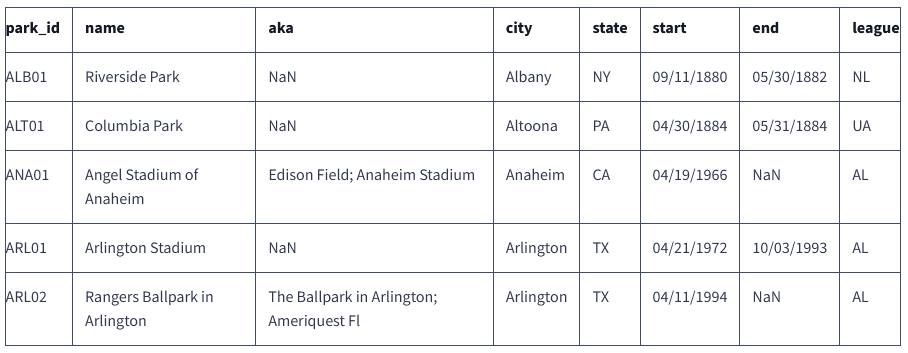

Designing and Creating a Database
================
Bastian Hartmann
9 Mar 2022

Our goals in this projects are:

-   Import data into SQLite
-   Design a normalized database schema
-   Create tables for our schema
-   Insert data into our schema

We will work with data from [Major League
Baseball](https://en.wikipedia.org/wiki/Major_League_Baseball) games
compiled by [Retrosheet](http://www.retrosheet.org/), a non-profit
organization that’s gathered game statistics going back to the 1800s to
today. The main file we will work from is `game_log.csv`, which has been
compiled and pre-cleaned from 127 separate CSV files from Retrosheet.
This file has hundreds of data points on each game. **Our goal is to
convert and normalize this data into several separate tables using SQL
and create a robust database of game-level statistics.**

In addition to the main file, we also have three “helper” files sourced
from Retrosheet:

-   `park_codes.csv`
-   `person_codes.csv`
-   `team_codes.csv`

These three helper files will make things easier since they will form
the basis for three of our normalized tables.

As a first step, we start with the *exploratory data analysis* (EDA).
Here focus on:

-   Becoming familiar with the meaning of each column in each file.
-   Thinking about the relationships between columns both within each
    file and across different files.

We have included a `game_log_fields.txt` file in the *sources* folder,
that explains the fields included in our main file to assist our EDA.
You can read `game_log_fields.txt` to look into the contents of the
file.

------------------------------------------------------------------------

## EDA

Let’s start by read and explore the data:

-   `game_log.csv` can be found
    [here](https://dsserver-prod-resources-1.s3.amazonaws.com/376/game_log.csv)
-   `park_codes.csv` can be found
    [here](https://dsserver-prod-resources-1.s3.amazonaws.com/376/park_codes.csv)
-   `person_codes.csv` can be found
    [here](https://dsserver-prod-resources-1.s3.amazonaws.com/376/person_codes.csv)
-   `team_codes.csv` can be found
    [here](https://dsserver-prod-resources-1.s3.amazonaws.com/376/team_codes.csv)

``` r
game_log <- read_csv("sources/game_log.csv", show_col_types = FALSE, col_types = cols(forfeit = "c",
                                                                                      rf_umpire_id = "c",
                                                                                      rf_umpire_name = "c",
                                                                                      completion = "c"))
park_codes <- read_csv("sources/park_codes.csv", show_col_types = FALSE)
person_codes <- read_csv("sources/person_codes.csv", show_col_types = FALSE)
team_codes <- read_csv("sources/team_codes.csv", show_col_types = FALSE)
```

#### game_log

``` r
dim(game_log)
```

    ## [1] 171907    161

``` r
knitr::kable(head(game_log))
```

|     date | number_of_game | day_of_week | v_name | v_league | v_game_number | h_name | h_league | h_game_number | v_score | h_score | length_outs | day_night | completion | forfeit | protest | park_id | attendance | length_minutes | v_line_score | h_line_score | v_at_bats | v_hits | v_doubles | v_triples | v_homeruns | v_rbi | v_sacrifice_hits | v_sacrifice_flies | v_hit_by_pitch | v_walks | v_intentional_walks | v_strikeouts | v_stolen_bases | v_caught_stealing | v_grounded_into_double | v_first_catcher_interference | v_left_on_base | v_pitchers_used | v_individual_earned_runs | v_team_earned_runs | v_wild_pitches | v_balks | v_putouts | v_assists | v_errors | v_passed_balls | v_double_plays | v_triple_plays | h_at_bats | h_hits | h_doubles | h_triples | h_homeruns | h_rbi | h_sacrifice_hits | h_sacrifice_flies | h_hit_by_pitch | h_walks | h_intentional_walks | h_strikeouts | h_stolen_bases | h_caught_stealing | h_grounded_into_double | h_first_catcher_interference | h_left_on_base | h_pitchers_used | h_individual_earned_runs | h_team_earned_runs | h_wild_pitches | h_balks | h_putouts | h_assists | h_errors | h_passed_balls | h_double_plays | h_triple_plays | hp_umpire_id | hp_umpire_name  | 1b_umpire_id | 1b_umpire_name | 2b_umpire_id | 2b_umpire_name | 3b_umpire_id | 3b_umpire_name | lf_umpire_id | lf_umpire_name | rf_umpire_id | rf_umpire_name | v_manager_id | v_manager_name | h_manager_id | h_manager_name | winning_pitcher_id | winning_pitcher_name | losing_pitcher_id | losing_pitcher_name | saving_pitcher_id | saving_pitcher_name | winning_rbi_batter_id | winning_rbi_batter_id_name | v_starting_pitcher_id | v_starting_pitcher_name | h_starting_pitcher_id | h_starting_pitcher_name | v_player_1\_id | v_player_1\_name | v_player_1\_def_pos | v_player_2\_id | v_player_2\_name | v_player_2\_def_pos | v_player_3\_id | v_player_3\_name | v_player_3\_def_pos | v_player_4\_id | v_player_4\_name | v_player_4\_def_pos | v_player_5\_id | v_player_5\_name | v_player_5\_def_pos | v_player_6\_id | v_player_6\_name | v_player_6\_def_pos | v_player_7\_id | v_player_7\_name | v_player_7\_def_pos | v_player_8\_id | v_player_8\_name | v_player_8\_def_pos | v_player_9\_id | v_player_9\_name | v_player_9\_def_pos | h_player_1\_id | h_player_1\_name | h_player_1\_def_pos | h_player_2\_id | h_player_2\_name | h_player_2\_def_pos | h_player_3\_id | h_player_3\_name | h_player_3\_def_pos | h_player_4\_id | h_player_4\_name | h_player_4\_def_pos | h_player_5\_id | h_player_5\_name | h_player_5\_def_pos | h_player_6\_id | h_player_6\_name | h_player_6\_def_pos | h_player_7\_id | h_player_7\_name | h_player_7\_def_pos | h_player_8\_id | h_player_8\_name | h_player_8\_def_pos | h_player_9\_id | h_player_9\_name | h_player_9\_def_pos | additional_info | acquisition_info |
|---------:|---------------:|:------------|:-------|:---------|--------------:|:-------|:---------|--------------:|--------:|--------:|------------:|:----------|:-----------|:--------|:--------|:--------|-----------:|---------------:|:-------------|:-------------|----------:|-------:|----------:|----------:|-----------:|------:|-----------------:|------------------:|---------------:|--------:|--------------------:|-------------:|---------------:|------------------:|-----------------------:|-----------------------------:|---------------:|----------------:|-------------------------:|-------------------:|---------------:|--------:|----------:|----------:|---------:|---------------:|---------------:|---------------:|----------:|-------:|----------:|----------:|-----------:|------:|-----------------:|------------------:|---------------:|--------:|--------------------:|-------------:|---------------:|------------------:|-----------------------:|-----------------------------:|---------------:|----------------:|-------------------------:|-------------------:|---------------:|--------:|----------:|----------:|---------:|---------------:|---------------:|---------------:|:-------------|:----------------|:-------------|:---------------|:-------------|:---------------|:-------------|:---------------|:-------------|:---------------|:-------------|:---------------|:-------------|:---------------|:-------------|:---------------|:-------------------|:---------------------|:------------------|:--------------------|:------------------|:--------------------|:----------------------|:---------------------------|:----------------------|:------------------------|:----------------------|:------------------------|:---------------|:-----------------|--------------------:|:---------------|:-----------------|--------------------:|:---------------|:-----------------|--------------------:|:---------------|:-----------------|--------------------:|:---------------|:-----------------|--------------------:|:---------------|:-----------------|--------------------:|:---------------|:-----------------|--------------------:|:---------------|:-----------------|--------------------:|:---------------|:-----------------|--------------------:|:---------------|:-----------------|--------------------:|:---------------|:-----------------|--------------------:|:---------------|:-----------------|--------------------:|:---------------|:-----------------|--------------------:|:---------------|:-----------------|--------------------:|:---------------|:-----------------|--------------------:|:---------------|:-----------------|--------------------:|:---------------|:-----------------|--------------------:|:---------------|:-----------------|--------------------:|:----------------|:-----------------|
| 18710504 |              0 | Thu         | CL1    | NA       |             1 | FW1    | NA       |             1 |       0 |       2 |          54 | D         | NA         | NA      | NA      | FOR01   |        200 |            120 | 000000000    | 010010000    |        30 |      4 |         1 |         0 |          0 |     0 |                0 |                 0 |              0 |       1 |                  NA |            6 |              1 |                NA |                     -1 |                           NA |              4 |               1 |                        1 |                  1 |              0 |       0 |        27 |         9 |        0 |              3 |              0 |              0 |        31 |      4 |         1 |         0 |          0 |     2 |                0 |                 0 |              0 |       1 |                  NA |            0 |              0 |                NA |                     -1 |                           NA |              3 |               1 |                        0 |                  0 |              0 |       0 |        27 |         3 |        3 |              1 |              1 |              0 | boakj901     | John Boake      | NA           | NA             | NA           | NA             | NA           | NA             | NA           | NA             | NA           | NA             | paboc101     | Charlie Pabor  | lennb101     | Bill Lennon    | mathb101           | Bobby Mathews        | prata101          | Al Pratt            | NA                | NA                  | NA                    | NA                         | prata101              | Al Pratt                | mathb101              | Bobby Mathews           | whitd102       | Deacon White     |                   2 | kimbg101       | Gene Kimball     |                   4 | paboc101       | Charlie Pabor    |                   7 | allia101       | Art Allison      |                   8 | white104       | Elmer White      |                   9 | prata101       | Al Pratt         |                   1 | sutte101       | Ezra Sutton      |                   5 | carlj102       | Jim Carleton     |                   3 | bassj101       | John Bass        |                   6 | selmf101       | Frank Sellman    |                   5 | mathb101       | Bobby Mathews    |                   1 | foraj101       | Jim Foran        |                   3 | goldw101       | Wally Goldsmith  |                   6 | lennb101       | Bill Lennon      |                   2 | caret101       | Tom Carey        |                   4 | mince101       | Ed Mincher       |                   7 | mcdej101       | James McDermott  |                   8 | kellb105       | Bill Kelly       |                   9 | NA              | Y                |
| 18710505 |              0 | Fri         | BS1    | NA       |             1 | WS3    | NA       |             1 |      20 |      18 |          54 | D         | NA         | NA      | NA      | WAS01   |       5000 |            145 | 107000435    | 640113030    |        41 |     13 |         1 |         2 |          0 |    13 |                0 |                 0 |              0 |      18 |                  NA |            5 |              3 |                NA |                     -1 |                           NA |             12 |               1 |                        6 |                  6 |              1 |       0 |        27 |        13 |       10 |              1 |              2 |              0 |        49 |     14 |         2 |         0 |          0 |    11 |                0 |                 0 |              0 |      10 |                  NA |            2 |              1 |                NA |                     -1 |                           NA |             14 |               1 |                        7 |                  7 |              0 |       0 |        27 |        20 |       10 |              2 |              3 |              0 | dobsh901     | Henry Dobson    | NA           | NA             | NA           | NA             | NA           | NA             | NA           | NA             | NA           | NA             | wrigh101     | Harry Wright   | younn801     | Nick Young     | spala101           | Al Spalding          | braia102          | Asa Brainard        | NA                | NA                  | NA                    | NA                         | spala101              | Al Spalding             | braia102              | Asa Brainard            | wrigg101       | George Wright    |                   6 | barnr102       | Ross Barnes      |                   4 | birdd102       | Dave Birdsall    |                   9 | mcvec101       | Cal McVey        |                   2 | wrigh101       | Harry Wright     |                   8 | goulc101       | Charlie Gould    |                   3 | schah101       | Harry Schafer    |                   5 | conef101       | Fred Cone        |                   7 | spala101       | Al Spalding      |                   1 | watef102       | Fred Waterman    |                   5 | forcd101       | Davy Force       |                   6 | mille105       | Everett Mills    |                   3 | allid101       | Doug Allison     |                   2 | hallg101       | George Hall      |                   7 | leona101       | Andy Leonard     |                   4 | braia102       | Asa Brainard     |                   1 | burrh101       | Henry Burroughs  |                   9 | berth101       | Henry Berthrong  |                   8 | HTBF            | Y                |
| 18710506 |              0 | Sat         | CL1    | NA       |             2 | RC1    | NA       |             1 |      12 |       4 |          54 | D         | NA         | NA      | NA      | RCK01   |       1000 |            140 | 610020003    | 010020100    |        49 |     11 |         1 |         1 |          0 |     8 |                0 |                 0 |              0 |       0 |                  NA |            1 |              0 |                NA |                     -1 |                           NA |             10 |               1 |                        0 |                  0 |              2 |       0 |        27 |        12 |        8 |              5 |              0 |              0 |        36 |      7 |         2 |         1 |          0 |     2 |                0 |                 0 |              0 |       0 |                  NA |            3 |              5 |                NA |                     -1 |                           NA |              5 |               1 |                        3 |                  3 |              1 |       0 |        27 |        12 |       13 |              3 |              0 |              0 | mawnj901     | J.H. Manny      | NA           | NA             | NA           | NA             | NA           | NA             | NA           | NA             | NA           | NA             | paboc101     | Charlie Pabor  | hasts101     | Scott Hastings | prata101           | Al Pratt             | fishc102          | Cherokee Fisher     | NA                | NA                  | NA                    | NA                         | prata101              | Al Pratt                | fishc102              | Cherokee Fisher         | whitd102       | Deacon White     |                   2 | kimbg101       | Gene Kimball     |                   4 | paboc101       | Charlie Pabor    |                   7 | allia101       | Art Allison      |                   8 | white104       | Elmer White      |                   9 | prata101       | Al Pratt         |                   1 | sutte101       | Ezra Sutton      |                   5 | carlj102       | Jim Carleton     |                   3 | bassj101       | John Bass        |                   6 | mackd101       | Denny Mack       |                   3 | addyb101       | Bob Addy         |                   4 | fishc102       | Cherokee Fisher  |                   1 | hasts101       | Scott Hastings   |                   8 | ham-r101       | Ralph Ham        |                   5 | ansoc101       | Cap Anson        |                   2 | sagep101       | Pony Sager       |                   6 | birdg101       | George Bird      |                   7 | stirg101       | Gat Stires       |                   9 | NA              | Y                |
| 18710508 |              0 | Mon         | CL1    | NA       |             3 | CH1    | NA       |             1 |      12 |      14 |          54 | D         | NA         | NA      | NA      | CHI01   |       5000 |            150 | 101403111    | 077000000    |        46 |     15 |         2 |         1 |          2 |    10 |                0 |                 0 |              0 |       0 |                  NA |            1 |              0 |                NA |                     -1 |                           NA |              7 |               1 |                        6 |                  6 |              0 |       0 |        27 |        15 |       11 |              6 |              0 |              0 |        43 |     11 |         2 |         0 |          0 |     8 |                0 |                 0 |              0 |       4 |                  NA |            2 |              1 |                NA |                     -1 |                           NA |              6 |               1 |                        4 |                  4 |              0 |       0 |        27 |        14 |        7 |              2 |              0 |              0 | willg901     | Gardner Willard | NA           | NA             | NA           | NA             | NA           | NA             | NA           | NA             | NA           | NA             | paboc101     | Charlie Pabor  | woodj106     | Jimmy Wood     | zettg101           | George Zettlein      | prata101          | Al Pratt            | NA                | NA                  | NA                    | NA                         | prata101              | Al Pratt                | zettg101              | George Zettlein         | whitd102       | Deacon White     |                   2 | kimbg101       | Gene Kimball     |                   4 | paboc101       | Charlie Pabor    |                   7 | allia101       | Art Allison      |                   8 | white104       | Elmer White      |                   9 | prata101       | Al Pratt         |                   1 | sutte101       | Ezra Sutton      |                   5 | carlj102       | Jim Carleton     |                   3 | bassj101       | John Bass        |                   6 | mcatb101       | Bub McAtee       |                   3 | kingm101       | Marshall King    |                   8 | hodec101       | Charlie Hodes    |                   2 | woodj106       | Jimmy Wood       |                   4 | simmj101       | Joe Simmons      |                   9 | folet101       | Tom Foley        |                   7 | duffe101       | Ed Duffy         |                   6 | pinke101       | Ed Pinkham       |                   5 | zettg101       | George Zettlein  |                   1 | NA              | Y                |
| 18710509 |              0 | Tue         | BS1    | NA       |             2 | TRO    | NA       |             1 |       9 |       5 |          54 | D         | NA         | NA      | NA      | TRO01   |       3250 |            145 | 000002232    | 101003000    |        46 |     17 |         4 |         1 |          0 |     6 |                0 |                 0 |              0 |       2 |                  NA |            0 |              1 |                NA |                     -1 |                           NA |             12 |               1 |                        2 |                  2 |              0 |       0 |        27 |        12 |        5 |              0 |              1 |              0 |        36 |      9 |         0 |         0 |          0 |     2 |                0 |                 0 |              0 |       3 |                  NA |            0 |              2 |                NA |                     -1 |                           NA |              7 |               1 |                        3 |                  3 |              1 |       0 |        27 |        11 |        7 |              3 |              0 |              0 | leroi901     | Isaac Leroy     | NA           | NA             | NA           | NA             | NA           | NA             | NA           | NA             | NA           | NA             | wrigh101     | Harry Wright   | pikel101     | Lip Pike       | spala101           | Al Spalding          | mcmuj101          | John McMullin       | NA                | NA                  | NA                    | NA                         | spala101              | Al Spalding             | mcmuj101              | John McMullin           | wrigg101       | George Wright    |                   6 | barnr102       | Ross Barnes      |                   4 | birdd102       | Dave Birdsall    |                   9 | mcvec101       | Cal McVey        |                   2 | wrigh101       | Harry Wright     |                   8 | goulc101       | Charlie Gould    |                   3 | schah101       | Harry Schafer    |                   5 | conef101       | Fred Cone        |                   7 | spala101       | Al Spalding      |                   1 | flync101       | Clipper Flynn    |                   9 | mcgem101       | Mike McGeary     |                   2 | yorkt101       | Tom York         |                   8 | mcmuj101       | John McMullin    |                   1 | kings101       | Steve King       |                   7 | beave101       | Edward Beavens   |                   4 | bells101       | Steve Bellan     |                   5 | pikel101       | Lip Pike         |                   3 | cravb101       | Bill Craver      |                   6 | HTBF            | Y                |
| 18710511 |              0 | Thu         | CH1    | NA       |             2 | CL1    | NA       |             4 |      18 |      10 |          48 | D         | NA         | V       | NA      | CLE01   |       2500 |            120 | 12120534     | 01410004     |        41 |     15 |         1 |         3 |          3 |    10 |                0 |                 0 |              0 |       8 |                  NA |            1 |              0 |                NA |                     -1 |                           NA |              7 |               1 |                        4 |                  4 |              0 |       0 |        24 |        11 |        4 |              3 |              0 |              0 |        39 |     13 |         1 |         2 |          1 |     7 |                0 |                 0 |              0 |       0 |                  NA |            0 |              0 |                NA |                     -1 |                           NA |              5 |               2 |                       10 |                 10 |              2 |       0 |        24 |         7 |        5 |              2 |              0 |              0 | haynj901     | J.H. Haynie     | NA           | NA             | NA           | NA             | NA           | NA             | NA           | NA             | NA           | NA             | woodj106     | Jimmy Wood     | paboc101     | Charlie Pabor  | zettg101           | George Zettlein      | prata101          | Al Pratt            | NA                | NA                  | NA                    | NA                         | zettg101              | George Zettlein         | prata101              | Al Pratt                | mcatb101       | Bub McAtee       |                   3 | kingm101       | Marshall King    |                   7 | hodec101       | Charlie Hodes    |                   2 | woodj106       | Jimmy Wood       |                   4 | simmj101       | Joe Simmons      |                   8 | folet101       | Tom Foley        |                   9 | duffe101       | Ed Duffy         |                   6 | pinke101       | Ed Pinkham       |                   5 | zettg101       | George Zettlein  |                   1 | whitd102       | Deacon White     |                   2 | kimbg101       | Gene Kimball     |                   4 | paboc101       | Charlie Pabor    |                   7 | allia101       | Art Allison      |                   8 | white104       | Elmer White      |                   9 | prata101       | Al Pratt         |                   1 | sutte101       | Ezra Sutton      |                   5 | carlj102       | Jim Carleton     |                   3 | bassj101       | John Bass        |                   6 | NA              | Y                |

It looks like the game log has a record of over 170,000 games. It looks
like these games are chronologically ordered and occur between 1871 and
2016.

For each game we have:

-   general information on the game
-   team level stats for each team
-   a list of players from each team, numbered, with their defensive
    positions
-   the umpires that officiated the game
-   some ‘awards’, like winning and losing pitcher

We have a `game_log_fields.txt` file that tell us that the player number
corresponds with the order in which they batted.

It’s worth noting that there is no natural primary key column for this
table.

#### park_codes

``` r
dim(park_codes)
```

    ## [1] 252   9

``` r
knitr::kable(head(park_codes))
```

| park_id | name                          | aka                                      | city      | state | start      | end        | league | notes                                          |
|:--------|:------------------------------|:-----------------------------------------|:----------|:------|:-----------|:-----------|:-------|:-----------------------------------------------|
| ALB01   | Riverside Park                | NA                                       | Albany    | NY    | 09/11/1880 | 05/30/1882 | NL     | TRN:9/11/80;6/15&9/10/1881;5/16-5/18&5/30/1882 |
| ALT01   | Columbia Park                 | NA                                       | Altoona   | PA    | 04/30/1884 | 05/31/1884 | UA     | NA                                             |
| ANA01   | Angel Stadium of Anaheim      | Edison Field; Anaheim Stadium            | Anaheim   | CA    | 04/19/1966 | NA         | AL     | NA                                             |
| ARL01   | Arlington Stadium             | NA                                       | Arlington | TX    | 04/21/1972 | 10/03/1993 | AL     | NA                                             |
| ARL02   | Rangers Ballpark in Arlington | The Ballpark in Arlington; Ameriquest Fl | Arlington | TX    | 04/11/1994 | NA         | AL     | NA                                             |
| ATL01   | Atlanta-Fulton County Stadium | NA                                       | Atlanta   | GA    | 04/12/1966 | 09/23/1996 | NL     | NA                                             |

This seems to be a list of all baseball parks. There are IDs which seem
to match with the game log, as well as names, nicknames, city and
league.

#### person_codes

``` r
dim(person_codes)
```

    ## [1] 20494     7

``` r
knitr::kable(head(person_codes))
```

| id       | last    | first    | player_debut | mgr_debut | coach_debut | ump_debut |
|:---------|:--------|:---------|:-------------|:----------|:------------|:----------|
| aardd001 | Aardsma | David    | 04/06/2004   | NA        | NA          | NA        |
| aaroh101 | Aaron   | Hank     | 04/13/1954   | NA        | NA          | NA        |
| aarot101 | Aaron   | Tommie   | 04/10/1962   | NA        | 04/06/1979  | NA        |
| aased001 | Aase    | Don      | 07/26/1977   | NA        | NA          | NA        |
| abada001 | Abad    | Andy     | 09/10/2001   | NA        | NA          | NA        |
| abadf001 | Abad    | Fernando | 07/28/2010   | NA        | NA          | NA        |

This seems to be a list of people with IDs. The IDs look like they match
up with those used in the game log. There are debut dates, for players,
managers, coaches and umpires. We can see that some people might have
been one or more of these roles.

It also looks like coaches and managers are two different things in
baseball. After some research, managers are what would be called a
‘coach’ or ‘head coach’ in other sports, and coaches are more
specialized, like base coaches. It also seems like coaches aren’t
recorded in the game log.

#### team_codes

``` r
dim(team_codes)
```

    ## [1] 150   8

``` r
knitr::kable(head(team_codes))
```

| team_id | league | start |  end | city      | nickname        | franch_id | seq |
|:--------|:-------|------:|-----:|:----------|:----------------|:----------|----:|
| ALT     | UA     |  1884 | 1884 | Altoona   | Mountain Cities | ALT       |   1 |
| ARI     | NL     |  1998 |    0 | Arizona   | Diamondbacks    | ARI       |   1 |
| BFN     | NL     |  1879 | 1885 | Buffalo   | Bisons          | BFN       |   1 |
| BFP     | PL     |  1890 | 1890 | Buffalo   | Bisons          | BFP       |   1 |
| BL1     | NA     |  1872 | 1874 | Baltimore | Canaries        | BL1       |   1 |
| BL2     | AA     |  1882 | 1891 | Baltimore | Orioles         | BL2       |   1 |

This seems to be a list of all teams, with team_ids which seem to match
the game log.

#### Summary: Dimensions

|        table | columns |   rows |
|-------------:|--------:|-------:|
|     game_log |     161 | 171907 |
|   park_codes |       9 |    252 |
| person_codes |       7 |  20494 |
|   team_codes |       8 |    150 |

#### Defensive Positions

In the game log, each player has a defensive position listed, which
seems to be a number between 1-10. Doing some research around this, I
found this
[article](http://probaseballinsider.com/baseball-instruction/baseball-basics/baseball-basics-positions/)
which gives us a list of names for each numbered position:

-   Pitcher
-   Catcher
-   1st Base
-   2nd Base
-   3rd Base
-   Shortstop
-   Left Field
-   Center Field
-   Right Field

The 10th position isn’t included, it may be a way of describing a
designated hitter that does not field. I can find a retrosheet page that
indicates that position 0 is used for this, but we don’t have any
position 0 in our data. I have chosen to make this an ‘Unknown Position’
so I’m not including data based on a hunch.

#### Leagues

Wikipedia tells us there are currently two leagues - the American (AL)
and National (NL). Upon investigation of the data, we see that there are
actually 4 more. After some googling, we come up with:

-   NL: National League
-   AL: American League
-   AA: [American
    Association](https://en.wikipedia.org/wiki/American_Association_%2819th_century%29)
-   FL: [Federal League](https://en.wikipedia.org/wiki/Federal_League)
-   PL: [Players
    League](https://en.wikipedia.org/wiki/Players%27_League)
-   UA: [Union
    Association](https://en.wikipedia.org/wiki/Union_Association)

It also looks like we have about 1000 games where the home team doesn’t
have a value for league.

## Importing Data into SQLite

The first step in normalization is to designate a primary key.
`game_log.csv` currently doesn’t have a single column that can be used
as a primary key to uniquely identify each game. There are a few ways
that we could handle this:

-   Consult the data itself for a viable candidate (not applicable to
    this situation).
-   Make an integer primary key, eg where the first row is `1`, the
    second row is `2`, etc.
-   Make a compound primary key, such as a primary key of the `date`,
    `h_name`, and `number_of_game` columns.
-   Insert a new column using a custom format.

We haven’t normalized our data yet, so it’s better not to start with our
own compound primary key. If we do this, other tables that reference
this game log table will also need a compound key to reference it,
making it more cumbersome to work with. An integer primary key could
also be a good choice, but luckily Retrosheet already has a system for
uniquely identifying each game. Since this is the case, this is a better
option. It means that if at some later stage we choose to incorporate
more detailed game data into our database, the keys we use will be
compatible with other sources.

We can find this [data
dictionary](http://www.retrosheet.org/eventfile.htm) on the Retrosheet
site for their event files, which list every event within each game.
This dictionary includes the following description:

**id:** *Each game begins with a twelve character ID record which
identifies the date, home team, and number of the game. For example,
`ATL198304080` should be read as follows. The first three characters
identify the home team (the Braves). The next four are the year (1983).
The next two are the month (April) using the standard numeric notation,
04, followed by the day (08). The last digit indicates if this is a
single game (0), first game (1) or second game (2) if more than one game
is played during a day, usually a double header The id record starts the
description of a game thus ending the description of the preceding game
in the file.*

This description essentially constructs a custom key using the three
columns we identified in our composite key example. After we import the
data, we’ll construct this column to use as a primary key in our final
database.

Next, we will import the data into SQLite. The `read_csv()` method from
the `readr` library in `tidyverse` makes bringing `csv` files into our R
environment easy. Once we have that done, we have a few ways to import
data into a SQLite database:

#### 1. Using the RSQLite library

The `RSQLite` library itself gives us a few ways to bring the data into
a SQLite database. By far, the easiest way is to load the data into a
variable, use the `dbWriteTable()` method and pass the variable into the
`value` argument.

#### 2. Using the SQLite shell

The other method for importing data is the SQLite shell.

This method is just like the `RSQLite` method and works well with large
data sources; however, several minor inconveniences accompany this
method which you should be aware of. SQLite detects the column types
using just the first row of data, which can lead to incorrect types.
You’ll need SQLite shell access, but if you’re not on your personal
laptop, you won’t always have.

**We’ll use the `RSQLite` library method in this instance!**

Therefore, we create a table for each loaded csv file in a new SQLite
database named `mlb.db`:

``` r
library(RSQLite)
library(DBI)

db <- "sources/mlb.db"

conn <- dbConnect(SQLite(),db)

dbWriteTable(conn,"game_log",game_log,row.names = FALSE, header = TRUE, overwrite = TRUE)
dbWriteTable(conn,"park_codes",park_codes,row.names = FALSE, header = TRUE, overwrite = TRUE)
dbWriteTable(conn,"person_codes",person_codes,row.names = FALSE, header = TRUE, overwrite = TRUE)
dbWriteTable(conn,"team_codes",team_codes,row.names = FALSE, header = TRUE, overwrite = TRUE)

dbDisconnect(conn)
```

In the `game_log` table, we will now create a column called `game_id`
that contains a unique ID using the Retrosheet format outlined above. As
an example, we print the first 10 entries of the new `game_id` column.

``` r
conn <- dbConnect(SQLite(),db)

q <- '
ALTER TABLE game_log
ADD COLUMN game_id TEXT;
'
dbExecute(conn,q)
```

    ## [1] 0

``` r
q <- '
UPDATE game_log
SET game_id = h_name||CAST(date AS INT)||CAST(number_of_game AS INT)
 WHERE game_id IS NULL;
'

dbExecute(conn,q)
```

    ## [1] 171907

``` r
q <- '
SELECT game_id FROM game_log
 LIMIT 10;
'

knitr::kable(dbGetQuery(conn,q))
```

| game_id      |
|:-------------|
| FW1187105040 |
| WS3187105050 |
| RC1187105060 |
| CH1187105080 |
| TRO187105090 |
| CL1187105110 |
| CL1187105130 |
| FW1187105130 |
| FW1187105150 |
| BS1187105160 |

``` r
dbDisconnect(conn)
```

------------------------------------------------------------------------

## Looking for Normalization Opportunities

Now we look for some opportunities to normalize the tables.

#### 1. Column repetition

As a first example, let’s look at the following subset of the `game_log`
data set:


Notice here that the first three columns contain the same types of
information as the next three. Without any context, we don’t know if
players across rows have any specific relationship, so we’ll assume that
none exists. We could “stack” these columns on top of each other to
remove this repetition. In order to preserve *all* of the information in
the above table, we just need to add another column to indicate which
set of columns (the former or latter) the player comes from. There are
two `def_pos` columns (1 or 2), so we’ll create another column `off_pos`
to contain information on which one the player belonged to:


#### 2. Non-primary key columns should be attributes of the primary key

Within a table, all of the columns should be related, or be an
*attribute*, to the primary key. Any columns that are not an attribute
to the primary key are better placed in their own tables. The primary
key of our game log is `game_id`, but the players’ names are not
attributes of a game, but of the player ID. If the only data we had was
the game log, we would remove this column and create a new table that
had the names of each player. As it happens, our `person_codes`table
already has a list of our player IDs and names, so we can remove these
without the need for creating a new table first.

#### 3. Repetition of data across tables

Lastly, we want to eliminate any redundant data that is available
elsewhere. This second example can be found in the `park_codes` table.
Let’s look at the first few rows:



The `start` and `end` columns indicate the dates for the first and last
games played at the park. This information can also be derived by
looking at the park information for each game, so we might want to
remove these columns from this table.

#### Other Opportunities

-   In person_codes, all the debut dates will be able to be reproduced
    using game log data.
-   In team_codes, the start, end and sequence columns will be able to
    be reproduced using game log data.
-   There are lots of places in game log where we have a player ID
    followed by the players name. We will be able to remove this and use
    the name data in person_codes
-   In game_log, all offensive and defensive stats are repeated for the
    home team and the visiting team. We could break these out and have a
    table that lists each game twice, one for each team, and cut out
    this column repetition.
-   Similarly, in game_log, we have a listing for 9 players on each team
    with their positions - we can remove these and have one table that
    tracks player appearances and their positions.
-   We can do a similar thing with the umpires from game_log, instead of
    listing all four positions as columns, we can put the umpires either
    in their own table or make one table for players, umpires and
    managers.
-   We have several awards in game_log like winning pitcher and losing
    pitcher. We can either break these out into their own table, have a
    table for awards, or combine the awards in with general appearances
    like the players and umpires.

------------------------------------------------------------------------

## Planning a Normalizied Schema

The next step in normalization is to start planning our schema. The best
way to work with schema diagrams is visually. Start by creating a
diagram of the four existing tables and their columns. Then, using the
rules laid out in the previous screen, gradually create new tables and
move the data into a more normalized state.

Some people like a more hands-on approach like pencil and paper, while
others prefer software like Sketch or Figma. If you’re unsure, we
recommend using a schema designing tool like
[DbDesigner.net](https://dbdesigner.net/). This free tool allows you to
create a schema and will create lines to clearly show foreign key
relations.


No matter what, you should choose the tool that suits you. In the end,
you still need a normalized schema. Here are some tips when planning out
your schema:

-   Don’t be afraid to experiment and iterate. It’s unlikely that your
    first few steps will be the finished product, so don’t expect
    perfection immediately.

-   Don’t sweat small details in the design. A tool like DbDesigner
    automatically shows lines for foreign key relationships, but don’t
    pay too much mind if your lines look messy. Focus on the
    normalization first, and then move the tables around to tidy things
    up at the end.

-   The following facts about the data may help you with your
    normalization decisions:

    -   Historically, teams sometimes move between leagues.
    -   The same person might be in a single game as both a player and a
        manager.
    -   Because of how pitchers are represented in the game log, not all
        pitchers used in a game will be shown. We only want to worry
        about the pitchers mentioned via position or the ‘winning
        pitcher’/ ‘losing pitcher’.

-   It is possible to over-normalize. Ultimately, we want to finish with
    about 7 to 8 tables total.

After all this considerations, this will be the schema that we will use
for the rest of this project:


The tables we will create are below, with some notes on the
normalization choices made:

-   person
    -   Each of the “debut” columns have been omitted, as the data will
        be able to be found from other tables.
    -   Since the game log file has no data on coaches, we made the
        decision to not include this data.
-   park
    -   The start, end, and league columns contain data that is found in
        the main game log and can be removed.
-   league
    -   Because some of the older leagues are not well known, we will
        create a table to store league names.
-   appearance_type
    -   Our appearance table will include data on players with
        positions, umpires, managers, and awards (like winning pitcher).
        This table will store information on what different types of
        appearances are available.

#### Creating the `person` table

``` r
conn <- dbConnect(SQLite(),db)

q1 <- '
CREATE TABLE IF NOT EXISTS person (
  person_id TEXT PRIMARY KEY,
  first_name TEXT,
  last_name TEXT
);
'
q2 <- '
INSERT OR IGNORE INTO person
SELECT
    id,
    first,
    last
  FROM person_codes
'

q3 <- '
SELECT * FROM person
 LIMIT  10;
'

dbExecute(conn,q1)
```

    ## [1] 0

``` r
dbExecute(conn,q2)
```

    ## [1] 20494

``` r
person_glimps <- dbGetQuery(conn,q3)
knitr::kable(person_glimps)
```

| person_id | first_name | last_name   |
|:----------|:-----------|:------------|
| aardd001  | David      | Aardsma     |
| aaroh101  | Hank       | Aaron       |
| aarot101  | Tommie     | Aaron       |
| aased001  | Don        | Aase        |
| abada001  | Andy       | Abad        |
| abadf001  | Fernando   | Abad        |
| abadj101  | John       | Abadie      |
| abbae101  | Ed         | Abbaticchio |
| abbeb101  | Bert       | Abbey       |
| abbec101  | Charlie    | Abbey       |

``` r
dbDisconnect(conn)
```

#### Creating the `park` table

``` r
conn <- dbConnect(SQLite(),db)

q1 <- '
CREATE TABLE IF NOT EXISTS park (
  park_id TEXT PRIMARY KEY,
  name TEXT,
  nickname TEXT,
  city TEXT,
  state TEXT,
  notes TEXT
)
'

q2 <- '
INSERT OR IGNORE INTO park
SELECT
    park_id,
    name,
    aka,
    city,
    state,
    notes
  FROM park_codes
'

q3 <- '
SELECT * FROM park
 LIMIT 10;
'
dbExecute(conn,q1)
```

    ## [1] 0

``` r
dbExecute(conn,q2)
```

    ## [1] 252

``` r
park_glimps <- dbGetQuery(conn,q3)
knitr::kable(park_glimps)
```

| park_id | name                          | nickname                                 | city      | state | notes                                          |
|:--------|:------------------------------|:-----------------------------------------|:----------|:------|:-----------------------------------------------|
| ALB01   | Riverside Park                | NA                                       | Albany    | NY    | TRN:9/11/80;6/15&9/10/1881;5/16-5/18&5/30/1882 |
| ALT01   | Columbia Park                 | NA                                       | Altoona   | PA    | NA                                             |
| ANA01   | Angel Stadium of Anaheim      | Edison Field; Anaheim Stadium            | Anaheim   | CA    | NA                                             |
| ARL01   | Arlington Stadium             | NA                                       | Arlington | TX    | NA                                             |
| ARL02   | Rangers Ballpark in Arlington | The Ballpark in Arlington; Ameriquest Fl | Arlington | TX    | NA                                             |
| ATL01   | Atlanta-Fulton County Stadium | NA                                       | Atlanta   | GA    | NA                                             |
| ATL02   | Turner Field                  | NA                                       | Atlanta   | GA    | NA                                             |
| ATL03   | Suntrust Park                 | NA                                       | Atlanta   | GA    | NA                                             |
| BAL01   | Madison Avenue Grounds        | NA                                       | Baltimore | MD    | WS3                                            |
| BAL02   | Newington Park                | NA                                       | Baltimore | MD    | BL1:1872-74; BL4:1873; BL2: 1882               |

``` r
dbDisconnect(conn)
```

#### Creation of the `league` table

``` r
conn <- dbConnect(SQLite(),db)

q1 <- '
CREATE TABLE IF NOT EXISTS league (
  league_id TEXT PRIMARY KEY,
  name TEXT
);
'
q2 <- '
INSERT OR IGNORE INTO league (league_id,name)
VALUES 
  ("AL","American League"),
  ("AA","American Association"),
  ("FL","Federal League"),
  ("PL","Players League"),
  ("UA","Union Association");
'
dbExecute(conn,q1)
```

    ## [1] 0

``` r
dbExecute(conn,q2)
```

    ## [1] 5

``` r
q3 <- '
SELECT * FROM league
'

league_table <- dbGetQuery(conn,q3)
knitr::kable(league_table)
```

| league_id | name                 |
|:----------|:---------------------|
| AL        | American League      |
| AA        | American Association |
| FL        | Federal League       |
| PL        | Players League       |
| UA        | Union Association    |

``` r
dbDisconnect(conn)
```

#### Creation of the `appearance_type` table

``` r
appearance_df <- read_csv("sources/appearance_type.csv",show_col_types = FALSE)

conn <- dbConnect(SQLite(),db)
dbWriteTable(conn,"dummy_table",appearance_df,row.names = FALSE, header = TRUE)

q1 <- '
CREATE TABLE IF NOT EXISTS appearance_type (
  appearance_type_id TEXT PRIMARY KEY,
  name TEXT,
  category TEXT
);
'
dbExecute(conn,q1)
```

    ## [1] 0

``` r
q2 <- '
INSERT OR IGNORE INTO appearance_type
SELECT * FROM dummy_table
'
dbExecute(conn,q2)
```

    ## [1] 31

``` r
q3 <- '
DROP TABLE dummy_table
'
dbExecute(conn,q3)
```

    ## [1] 0

``` r
q4 <- '
SELECT * FROM appearance_type
'

appearance_type_table <- dbGetQuery(conn,q4)
knitr::kable(appearance_type_table)
```

| appearance_type_id | name               | category |
|:-------------------|:-------------------|:---------|
| O1                 | Batter 1           | offense  |
| O2                 | Batter 2           | offense  |
| O3                 | Batter 3           | offense  |
| O4                 | Batter 4           | offense  |
| O5                 | Batter 5           | offense  |
| O6                 | Batter 6           | offense  |
| O7                 | Batter 7           | offense  |
| O8                 | Batter 8           | offense  |
| O9                 | Batter 9           | offense  |
| D1                 | Pitcher            | defense  |
| D2                 | Catcher            | defense  |
| D3                 | 1st Base           | defense  |
| D4                 | 2nd Base           | defense  |
| D5                 | 3rd Base           | defense  |
| D6                 | Shortstop          | defense  |
| D7                 | Left Field         | defense  |
| D8                 | Center Field       | defense  |
| D9                 | Right Field        | defense  |
| D10                | Unknown Position   | defense  |
| UHP                | Home Plate         | umpire   |
| U1B                | First Base         | umpire   |
| U2B                | Second Base        | umpire   |
| U3B                | Third Base         | umpire   |
| ULF                | Left Field         | umpire   |
| URF                | Right Field        | umpire   |
| MM                 | Manager            | manager  |
| AWP                | Winning Pitcher    | award    |
| ALP                | Losing Pitcher     | award    |
| ASP                | Saving Pitcher     | award    |
| AWB                | Winning RBI Batter | award    |
| PSP                | Starting Pitcher   | pitcher  |

``` r
dbDisconnect(conn)
```

------------------------------------------------------------------------

## Adding the Team and Game Tables

The next two tables we need to add are `game` and `team`. These two
tables need to exist before `person_appearance` and `team_appearance`
are created.

Here is the reduced schema of these tables, and the foreign key
relations between them:


Here are some notes on the normalization choices made with each of these
tables:

-   team
    -   The start, end, and sequence columns can be derived from the
        game level data.
-   game
    -   We have chosen to include all columns for the game log that
        don’t refer to one specific team or player, instead putting
        those in two appearance tables.
    -   We have removed the column with the day of the week, as this can
        be derived from the date.
    -   We have changed the `day_night` column to `day`, with the
        intention of making this a boolean column. Even though SQLite
        doesn’t support the `BOOLEAN` type, we can use this when
        creating our table and SQLite will manage the underlying types
        behind the scenes (for more on how this works refer to [the
        SQLite documentation](https://www.sqlite.org/datatype3.html)).
        This means that anyone quering the schema of our database in the
        future understands how that column is intended to be used.

Let’s create the `team` and `game` tables.

#### Creation of the `team` table

``` r
conn <- dbConnect(SQLite(),db)

q1 <- '
CREATE TABLE IF NOT EXISTS team (
  team_id TEXT PRIMARY KEY,
  league_id TEXT,
  city TEXT,
  nickname TEXT,
  franch_id TEXT,
  FOREIGN KEY (league_id) REFERENCES league(league_id)
);
'
dbExecute(conn,q1)
```

    ## [1] 0

``` r
q2 <- '
INSERT OR IGNORE INTO team
SELECT
    team_id,
    league,
    city,
    nickname,
    franch_id
  FROM team_codes
'
dbExecute(conn,q2)
```

    ## [1] 150

``` r
team_glimps <- dbGetQuery(conn,"SELECT * FROM team LIMIT 10;")
knitr::kable(team_glimps)
```

| team_id | league_id | city      | nickname        | franch_id |
|:--------|:----------|:----------|:----------------|:----------|
| ALT     | UA        | Altoona   | Mountain Cities | ALT       |
| ARI     | NL        | Arizona   | Diamondbacks    | ARI       |
| BFN     | NL        | Buffalo   | Bisons          | BFN       |
| BFP     | PL        | Buffalo   | Bisons          | BFP       |
| BL1     | NA        | Baltimore | Canaries        | BL1       |
| BL2     | AA        | Baltimore | Orioles         | BL2       |
| BLN     | NL        | Baltimore | Orioles         | BL2       |
| BL4     | NA        | Baltimore | Marylands       | BL4       |
| BLA     | AL        | Baltimore | Orioles         | BLA       |
| NYA     | AL        | New York  | Yankees         | BLA       |

``` r
dbDisconnect(conn)
```

#### Creation of the `game` table

``` r
conn <- dbConnect(SQLite(),db)

q1 <- '
CREATE TABLE IF NOT EXISTS game (
  game_id TEXT PRIMARY KEY,
  date INTEGER,
  number_of_game INTEGER,
  park_id TEXT,
  length_outs INTEGER,
  day BOOLEAN,
  completion TEXT,
  forfeit TEXT,
  protest TEXT,
  attendance INTEGER,
  length_minutes INTEGER,
  additional_info TEXT,
  acquisition_info TEXT,
  FOREIGN KEY (park_id) REFERENCES park(park_id)
);
'
dbExecute(conn,q1)
```

    ## [1] 0

``` r
q2 <- '
INSERT OR IGNORE INTO game
SELECT
    game_id,
    date,
    number_of_game,
    park_id,
    length_outs,
    CASE
        WHEN day_night = "D" THEN 1
        WHEN day_night = "N" THEN 0
        ELSE NULL
    END AS day,
    completion,
    forfeit,
    protest,
    attendance,
    length_minutes,
    additional_info,
    acquisition_info
  FROM game_log;
'
dbExecute(conn,q2)
```

    ## [1] 171907

``` r
q3 <- '
SELECT * FROM game LIMIT 10;
'
game_glimps <- dbGetQuery(conn,q3)
knitr::kable(game_glimps)
```

| game_id      |     date | number_of_game | park_id | length_outs | day | completion | forfeit | protest | attendance | length_minutes | additional_info | acquisition_info |
|:-------------|---------:|---------------:|:--------|------------:|----:|:-----------|:--------|:--------|-----------:|---------------:|:----------------|:-----------------|
| FW1187105040 | 18710504 |              0 | FOR01   |          54 |   1 | NA         | NA      | NA      |        200 |            120 | NA              | Y                |
| WS3187105050 | 18710505 |              0 | WAS01   |          54 |   1 | NA         | NA      | NA      |       5000 |            145 | HTBF            | Y                |
| RC1187105060 | 18710506 |              0 | RCK01   |          54 |   1 | NA         | NA      | NA      |       1000 |            140 | NA              | Y                |
| CH1187105080 | 18710508 |              0 | CHI01   |          54 |   1 | NA         | NA      | NA      |       5000 |            150 | NA              | Y                |
| TRO187105090 | 18710509 |              0 | TRO01   |          54 |   1 | NA         | NA      | NA      |       3250 |            145 | HTBF            | Y                |
| CL1187105110 | 18710511 |              0 | CLE01   |          48 |   1 | NA         | V       | NA      |       2500 |            120 | NA              | Y                |
| CL1187105130 | 18710513 |              0 | CIN01   |          54 |   1 | NA         | NA      | NA      |       1200 |            150 | NA              | Y                |
| FW1187105130 | 18710513 |              0 | FOR01   |          54 |   1 | NA         | NA      | NA      |       1500 |            105 | NA              | Y                |
| FW1187105150 | 18710515 |              0 | FOR01   |          54 |   1 | NA         | NA      | NA      |         NA |            140 | NA              | Y                |
| BS1187105160 | 18710516 |              0 | BOS01   |          54 |   1 | NA         | NA      | NA      |       2500 |             NA | HTBF            | Y                |

``` r
dbDisconnect(conn)
```

------------------------------------------------------------------------

## Adding the Team Appearance Table

Our next task is to add the `team_appearance` table. Here is the schema
of the table and the three tables it has foreign key relations to:


The `team_appearance` table has a compound primary key composed of
`team_id` and `game_id`. The `home` is a Boolean column used to
differentiate between the home and away teams. The rest of the columns
are scores or statistics that are repeated for each of the home and away
teams in our original game log.

``` r
conn <- dbConnect(SQLite(),db)

q1 <- '
CREATE TABLE IF NOT EXISTS team_appearance (
      team_id TEXT,
      game_id TEXT,
      home BOOLEAN,
      league_id TEXT,
      score INTEGER,
      line_score TEXT,
      at_bats INTEGER,
      hits INTEGER,
      doubles INTEGER,
      triples INTEGER,
      homeruns INTEGER,
      rbi INTEGER,
      sacrifice_hits INTEGER,
      sacrifice_flies INTEGER,
      hit_by_pitch INTEGER,
      walks INTEGER,
      intentional_walks INTEGER,
      strikeouts INTEGER,
      stolen_bases INTEGER,
      caught_stealing INTEGER,
      grounded_into_double INTEGER,
      first_catcher_interference INTEGER,
      left_on_base INTEGER,
      pitchers_used INTEGER,
      individual_earned_runs INTEGER,
      team_earned_runs INTEGER,
      wild_pitches INTEGER,
      balks INTEGER,
      putouts INTEGER,
      assists INTEGER,
      errors INTEGER,
      passed_balls INTEGER,
      double_plays INTEGER,
      triple_plays INTEGER,
      PRIMARY KEY (team_id, game_id),
      FOREIGN KEY (team_id) REFERENCES team(team_id),
      FOREIGN KEY (game_id) REFERENCES game(game_id)
  );
'
dbExecute(conn,q1)
```

    ## [1] 0

``` r
q2 <- '
INSERT OR IGNORE INTO team_appearance
      SELECT
          h_name,
          game_id,
          1 AS home,
          h_league,
          h_score,
          h_line_score,
          h_at_bats,
          h_hits,
          h_doubles,
          h_triples,
          h_homeruns,
          h_rbi,
          h_sacrifice_hits,
          h_sacrifice_flies,
          h_hit_by_pitch,
          h_walks,
          h_intentional_walks,
          h_strikeouts,
          h_stolen_bases,
          h_caught_stealing,
          h_grounded_into_double,
          h_first_catcher_interference,
          h_left_on_base,
          h_pitchers_used,
          h_individual_earned_runs,
          h_team_earned_runs,
          h_wild_pitches,
          h_balks,
          h_putouts,
          h_assists,
          h_errors,
          h_passed_balls,
          h_double_plays,
          h_triple_plays
      FROM game_log
  
  UNION
  
      SELECT    
          v_name,
          game_id,
          0 AS home,
          v_league,
          v_score,
          v_line_score,
          v_at_bats,
          v_hits,
          v_doubles,
          v_triples,
          v_homeruns,
          v_rbi,
          v_sacrifice_hits,
          v_sacrifice_flies,
          v_hit_by_pitch,
          v_walks,
          v_intentional_walks,
          v_strikeouts,
          v_stolen_bases,
          v_caught_stealing,
          v_grounded_into_double,
          v_first_catcher_interference,
          v_left_on_base,
          v_pitchers_used,
          v_individual_earned_runs,
          v_team_earned_runs,
          v_wild_pitches,
          v_balks,
          v_putouts,
          v_assists,
          v_errors,
          v_passed_balls,
          v_double_plays,
          v_triple_plays
      from game_log;
'
dbExecute(conn,q2)
```

    ## [1] 343814

``` r
q3 <- '
SELECT * FROM team_appearance
  WHERE game_id = (
                   SELECT MIN(game_id) from game
                  )
     OR game_id = (
                   SELECT MAX(game_id) from game
                  )
  ORDER By game_id, home;
'

team_appearance_check <- dbGetQuery(conn,q3)
knitr::kable(team_appearance_check)
```

| team_id | game_id      | home | league_id | score | line_score | at_bats | hits | doubles | triples | homeruns | rbi | sacrifice_hits | sacrifice_flies | hit_by_pitch | walks | intentional_walks | strikeouts | stolen_bases | caught_stealing | grounded_into_double | first_catcher_interference | left_on_base | pitchers_used | individual_earned_runs | team_earned_runs | wild_pitches | balks | putouts | assists | errors | passed_balls | double_plays | triple_plays |
|:--------|:-------------|-----:|:----------|------:|:-----------|--------:|-----:|--------:|--------:|---------:|----:|---------------:|----------------:|-------------:|------:|------------------:|-----------:|-------------:|----------------:|---------------------:|---------------------------:|-------------:|--------------:|-----------------------:|-----------------:|-------------:|------:|--------:|--------:|-------:|-------------:|-------------:|-------------:|
| SLU     | ALT188404300 |    0 | UA        |    15 | NA         |      NA |   NA |      NA |      NA |       NA |  NA |             NA |              NA |           NA |    NA |                NA |         NA |           NA |              NA |                   NA |                         NA |           NA |            NA |                     NA |               NA |           NA |    NA |      NA |      NA |     NA |           NA |           NA |           NA |
| ALT     | ALT188404300 |    1 | UA        |     2 | NA         |      NA |   NA |      NA |      NA |       NA |  NA |             NA |              NA |           NA |    NA |                NA |         NA |           NA |              NA |                   NA |                         NA |           NA |            NA |                     NA |               NA |           NA |    NA |      NA |      NA |     NA |           NA |           NA |           NA |
| BSU     | WSU188409250 |    0 | UA        |     2 | NA         |      NA |   NA |      NA |      NA |       NA |  NA |             NA |              NA |           NA |    NA |                NA |         NA |           NA |              NA |                   NA |                         NA |           NA |            NA |                     NA |               NA |           NA |    NA |      NA |      NA |     NA |           NA |           NA |           NA |
| WSU     | WSU188409250 |    1 | UA        |    10 | NA         |      NA |   NA |      NA |      NA |       NA |  NA |             NA |              NA |           NA |    NA |                NA |         NA |           NA |              NA |                   NA |                         NA |           NA |            NA |                     NA |               NA |           NA |    NA |      NA |      NA |     NA |           NA |           NA |           NA |

``` r
dbDisconnect(conn)
```

------------------------------------------------------------------------

## Adding the Person Appearance Table

The final table we need to create is `person_appearance`. Here is the
schema of the table and the four tables it has foreign key relations to:


The `person_appearance` table will be used to store information on
appearances in games by managers, players, and umpires as detailed in
the `appearance_type` table.

Here, the primary key for `person_appearance` will be an integer. In
SQLite, if you have an integer primary key and don’t specify a value for
this column when inserting rows, [SQLite will autoincrement this column
for you](https://sqlite.org/autoinc.html).

When we get to the offensive and defensive positions for both teams, we
essentially are performing `36` permutations: `2` (home, away) \* `2`
(offense + defense) \* `9` (9 positions).

``` r
conn <- dbConnect(SQLite(),db)

q1 <- '
CREATE TABLE IF NOT EXISTS person_appearance (
      appearance_id INTEGER PRIMARY KEY,
      person_id TEXT,
      team_id TEXT,
      game_id TEXT,
      appearance_type_id,
      FOREIGN KEY (person_id) REFERENCES person(person_id),
      FOREIGN KEY (team_id) REFERENCES team(team_id),
      FOREIGN KEY (game_id) REFERENCES game(game_id),
      FOREIGN KEY (appearance_type_id) REFERENCES appearance_type(appearance_type_id)
  );
'
dbExecute(conn,q1)
```

    ## [1] 0

``` r
q2 <- '
INSERT OR IGNORE INTO person_appearance (
      game_id,
      team_id,
      person_id,
      appearance_type_id
  ) 
      SELECT
          game_id,
          NULL,
          hp_umpire_id,
          "UHP"
      FROM game_log
      WHERE hp_umpire_id IS NOT NULL    
  
  UNION
  
      SELECT
          game_id,
          NULL,
          [1b_umpire_id],
          "U1B"
      FROM game_log
      WHERE "1b_umpire_id" IS NOT NULL
  
  UNION
  
      SELECT
          game_id,
          NULL,
          [2b_umpire_id],
          "U2B"
      FROM game_log
      WHERE [2b_umpire_id] IS NOT NULL
  
  UNION
  
      SELECT
          game_id,
          NULL,
          [3b_umpire_id],
          "U3B"
      FROM game_log
      WHERE [3b_umpire_id] IS NOT NULL
  
  UNION
  
      SELECT
          game_id,
          NULL,
          lf_umpire_id,
          "ULF"
      FROM game_log
      WHERE lf_umpire_id IS NOT NULL
  
  UNION
  
      SELECT
          game_id,
          NULL,
          rf_umpire_id,
          "URF"
      FROM game_log
      WHERE rf_umpire_id IS NOT NULL
  
  UNION
  
      SELECT
          game_id,
          v_name,
          v_manager_id,
          "MM"
      FROM game_log
      WHERE v_manager_id IS NOT NULL
  
  UNION
  
      SELECT
          game_id,
          h_name,
          h_manager_id,
          "MM"
      FROM game_log
      WHERE h_manager_id IS NOT NULL
  
  UNION
  
      SELECT
          game_id,
          CASE
              WHEN h_score > v_score THEN h_name
              ELSE v_name
              END,
          winning_pitcher_id,
          "AWP"
      FROM game_log
      WHERE winning_pitcher_id IS NOT NULL
  
  UNION
  
      SELECT
          game_id,
          CASE
              WHEN h_score < v_score THEN h_name
              ELSE v_name
              END,
          losing_pitcher_id,
          "ALP"
      FROM game_log
      WHERE losing_pitcher_id IS NOT NULL
  
  UNION
  
      SELECT
          game_id,
          CASE
              WHEN h_score > v_score THEN h_name
              ELSE v_name
              END,
          saving_pitcher_id,
          "ASP"
      FROM game_log
      WHERE saving_pitcher_id IS NOT NULL
  
  UNION
  
      SELECT
          game_id,
          CASE
              WHEN h_score > v_score THEN h_name
              ELSE v_name
              END,
          winning_rbi_batter_id,
          "AWB"
      FROM game_log
      WHERE winning_rbi_batter_id IS NOT NULL
  
  UNION
  
      SELECT
          game_id,
          v_name,
          v_starting_pitcher_id,
          "PSP"
      FROM game_log
      WHERE v_starting_pitcher_id IS NOT NULL
  
  UNION
  
      SELECT
          game_id,
          h_name,
          h_starting_pitcher_id,
          "PSP"
      FROM game_log
      WHERE h_starting_pitcher_id IS NOT NULL;
'
dbExecute(conn, q2)
```

    ## [1] 1646118

``` r
dbDisconnect(conn)
```

``` r
conn <- dbConnect(SQLite(),db)

for (letter in c("h", "v")) {
  for (num in 1:9) {
    template <- '
      INSERT INTO person_appearance (
          game_id,
          team_id,
          person_id,
          appearance_type_id
      ) 
          SELECT
              game_id,
              %s_name,
              %s_player_%f_id,
              "O%f"
          FROM game_log
          WHERE %s_player_%f_id IS NOT NULL
      
      UNION
      
          SELECT
              game_id,
              %s_name,
              %s_player_%f_id,
              "D" || CAST(%s_player_%f_def_pos AS INT)
          FROM game_log
          WHERE %s_player_%f_id IS NOT NULL;
    '
    # replace all of the %s and %f with the correct letter number
    template <- gsub("%s", letter, template, fixed = TRUE)
    template <- gsub("%f", num, template, fixed = TRUE)
    
    dbExecute(conn, template)
  }
}

person_appearance_glimps <- dbGetQuery(conn,"SELECT * FROM person_appearance LIMIT 10;")
knitr::kable(person_appearance_glimps)
```

| appearance_id | person_id | team_id | game_id      | appearance_type_id |
|--------------:|:----------|:--------|:-------------|:-------------------|
|             1 | maplb901  | NA      | ALT188404300 | UHP                |
|             2 | curte801  | ALT     | ALT188404300 | MM                 |
|             3 | murpj104  | ALT     | ALT188404300 | PSP                |
|             4 | hodnc101  | SLU     | ALT188404300 | PSP                |
|             5 | sullt101  | SLU     | ALT188404300 | MM                 |
|             6 | hoopm101  | NA      | ALT188405020 | UHP                |
|             7 | curte801  | ALT     | ALT188405020 | MM                 |
|             8 | learj102  | ALT     | ALT188405020 | PSP                |
|             9 | sullt101  | SLU     | ALT188405020 | MM                 |
|            10 | taylb103  | SLU     | ALT188405020 | PSP                |

``` r
dbDisconnect(conn)
```

## Removing the Original Tables

We’ve now created all normalized tables and inserted all of our data!

Our last task is to remove the tables we created to import the original
CSVs.

``` r
conn <- dbConnect(SQLite(),db)

q <- 'DROP TABLE game_log;'
dbExecute(conn,q)
```

    ## [1] 0

``` r
q <- 'DROP TABLE park_codes;'
dbExecute(conn,q)
```

    ## [1] 0

``` r
q <- 'DROP TABLE team_codes;'
dbExecute(conn,q)
```

    ## [1] 0

``` r
q <- 'DROP TABLE person_codes;'
dbExecute(conn,q)
```

    ## [1] 0

``` r
dbDisconnect(conn)
```
