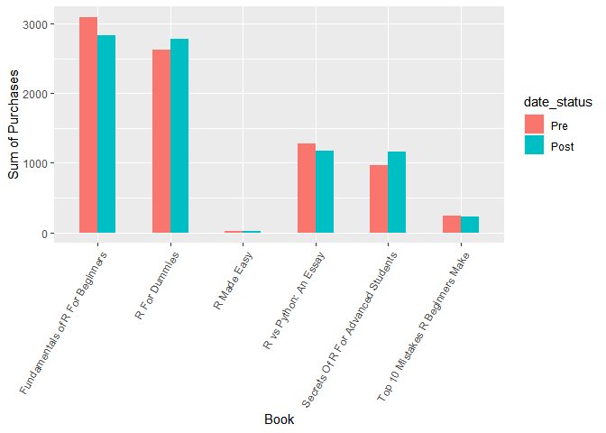
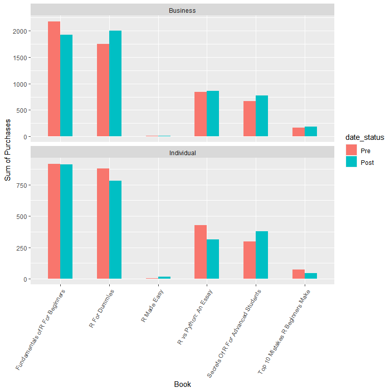
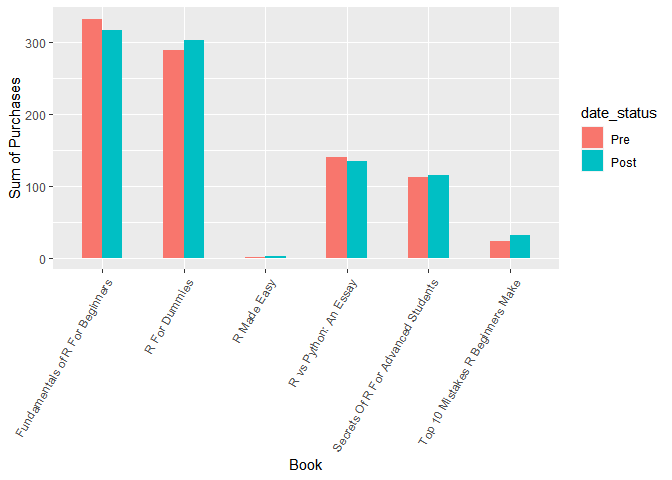

Creating An Efficient Data Analysis Workflow - Part 2
================
Bastian Hartmann
03 February 2022

## Introduction

In this project, Like in the last guided project, we are taking on the
role of as an analyst for a book company. The company has provided us
more data on some of its 2019 book sales, and it wants us to extract
some usable knowledge from it. It launched a new program encouraging
customers to buy more books on July 1st, 2019, and it wants to know **if
this new program was successful at increasing sales and improving review
quality**. As the analyst, this will be your job to figure out.

You can download the dataset
[here](https://data.world/dataquest/book-sales-data).

------------------------------------------------------------------------

## Data Exploration

As first step, we load the dataset and explore the data itself and make
note of any potential problems that we might run into.

Therefore, we look for the following things:

-   How big is the dataset? What are the column names and what do they
    represent?
-   What are the types of each of the columns?
-   Do any of the columns have missing data?

``` r
# Loading the dataset
sales <- read_csv("sources/sales2019.csv",show_col_types = FALSE)

# Explore the size
print(dim(sales))
```

    ## [1] 5000    5

``` r
# Explore the first 10 rows of the dataset
knitr::kable(head(sales))
```

| date     | user_submitted_review    | title                              | total_purchased | customer_type |
|:---------|:-------------------------|:-----------------------------------|----------------:|:--------------|
| 5/22/19  | it was okay              | Secrets Of R For Advanced Students |               7 | Business      |
| 11/16/19 | Awesome!                 | R For Dummies                      |               3 | Business      |
| 6/27/19  | Awesome!                 | R For Dummies                      |               1 | Individual    |
| 11/6/19  | Awesome!                 | Fundamentals of R For Beginners    |               3 | Individual    |
| 7/18/19  | Hated it                 | Fundamentals of R For Beginners    |              NA | Business      |
| 1/28/19  | Never read a better book | Secrets Of R For Advanced Students |               1 | Business      |

``` r
# Explore the data type of each column
str(sales)
```

    ## spec_tbl_df [5,000 x 5] (S3: spec_tbl_df/tbl_df/tbl/data.frame)
    ##  $ date                 : chr [1:5000] "5/22/19" "11/16/19" "6/27/19" "11/6/19" ...
    ##  $ user_submitted_review: chr [1:5000] "it was okay" "Awesome!" "Awesome!" "Awesome!" ...
    ##  $ title                : chr [1:5000] "Secrets Of R For Advanced Students" "R For Dummies" "R For Dummies" "Fundamentals of R For Beginners" ...
    ##  $ total_purchased      : num [1:5000] 7 3 1 3 NA 1 5 NA 7 1 ...
    ##  $ customer_type        : chr [1:5000] "Business" "Business" "Individual" "Individual" ...
    ##  - attr(*, "spec")=
    ##   .. cols(
    ##   ..   date = col_character(),
    ##   ..   user_submitted_review = col_character(),
    ##   ..   title = col_character(),
    ##   ..   total_purchased = col_double(),
    ##   ..   customer_type = col_character()
    ##   .. )
    ##  - attr(*, "problems")=<externalptr>

From the two observations above, we can see that the dataset consist of
5000 rows and 5 columns.

The columns and their current data types are:

-   **date** \[Type: *character*\]: The date of the corresponding book
    sale.
-   **user_submitted_review** \[Type: *character*\]: The submitted
    review by the buyer as one of 9 distinct descriptions.
-   **title** \[Type: *character*\]: Title of the sold book.
-   **total_purchased** \[Type: *double*\]: Total number of purchased
    books.
-   **customer_type** \[Type: *character*\]: Describes the customer type
    as either *Business* or *Individual*.

``` r
# Missing values of dataset
ColNa <- colnames(sales)
cat("Column","\t","Missing Values",fill = TRUE)
cat(" "," ","\n")
for (i in ColNa){
  missNum <- sum(is.na(sales[[i]]))
  cat(i,"\t",toString(missNum),fill = TRUE)

}
```

    ## Column    Missing Values
    ##     
    ## date      0
    ## user_submitted_review     885
    ## title     0
    ## total_purchased   718
    ## customer_type     0

Here, we can see that the columns `user_submitted_review` (885) and
`total_purchased` (718) both have missing values that could leed to some
problems if not taken care of.

------------------------------------------------------------------------

## Handling Missing Data

We are going to handle the two columns with missing columns differently.
The reason for this is due to the fact that we care a lot more about the
`total_purchased` column, because it contains the actual information on
book sales. We want to determine if the company’s new program helped to
improve sales.

In short, we’re going to:

1.  remove any rows that have missing data in `user_submitted_review`
    and
2.  for `total_purchased`, we’re are going to replace all of the `NA`
    values with an average value that we calculate from the complete
    dataset.

Filling in missing data with average values is useful because they are
often the best guesses for what the purchase would have been. We do this
in everyday life too. If someone asked you how much time you slept each
day, you’re more likely than not to answer with the average amount of
time you sleep in a week. We’re going to apply the same concept here.

``` r
# 1.  remove any rows that have missing data in `user_submitted_review`
sales_filtered <- sales %>%
  filter(!(is.na(user_submitted_review)))

cat("Dims:","\t",dim(sales_filtered))
```

    ## Dims:     4115 5

From the dimensions of the `sales_filtered` dataframe, we can see that
the 885 rows are removed where `user_submitted_review` had a missing
value

``` r
# 2. replace all of the `NA` values with an average value for `total_purchased`
purchased_mean = mean(sales_filtered$total_purchased,na.rm = TRUE)
sales_filtered <- sales_filtered %>%
  replace_na(list(total_purchased=purchased_mean))

cat("Dims:","\t",dim(sales_filtered))
```

    ## Dims:     4115 5

We see that our operation didn’t removed any rows. But looking at the
missing values of `total_purchased` we can see that all `NAs` have been
replaced:

``` r
sum(is.na(sales_filtered$total_purchased)) %>% cat(" missing values")
```

    ## 0  missing values

------------------------------------------------------------------------

## Processing Review Data

The `user_submitted_review` column contains reviews in the form of
sentences. Ultimately, we want to be able to classify reviews as either
positive or negative. This allows us to count the number of negative or
positive reviews in the analysis part of the workflow. On this screen,
we’ll perform the cleaning and processing necessary to turn each of the
review sentences into the classifications we want.

Therefore, we first print all unique sentences of the
`user_submitted_review` column to detect specific words or phrases that
help indicate if the review is positive or not:

``` r
unique(sales_filtered$user_submitted_review) %>%
  knitr::kable()
```

| x                                    |
|:-------------------------------------|
| it was okay                          |
| Awesome!                             |
| Hated it                             |
| Never read a better book             |
| OK                                   |
| The author’s other books were better |
| A lot of material was not needed     |
| Would not recommend                  |
| I learned a lot                      |

Observing this list, we can conclude that the following words can be
used to detect positive feedbacks:

-   Awesome
-   OK
-   Never
-   a lot

Next, we create a new column `review_positive` that indicates if the
review is positive or not by `TRUE` or `FALSE`, respectively.

``` r
is_positive <- function(in_str){
  bool_val <- case_when(
    str_detect(in_str,"Awesome") ~ TRUE,
    str_detect(in_str,"OK") ~ TRUE,
    str_detect(in_str,"Never") ~ TRUE,
    str_detect(in_str,"a lot") ~ TRUE,
    TRUE ~ FALSE
  )
  return(bool_val)
}

sales_filtered <- sales_filtered %>%
  mutate(
    review_positive = map(user_submitted_review,is_positive)
  )

knitr::kable(head(sales_filtered))
```

| date     | user_submitted_review    | title                              | total_purchased | customer_type | review_positive |
|:---------|:-------------------------|:-----------------------------------|----------------:|:--------------|:----------------|
| 5/22/19  | it was okay              | Secrets Of R For Advanced Students |        7.000000 | Business      | FALSE           |
| 11/16/19 | Awesome!                 | R For Dummies                      |        3.000000 | Business      | TRUE            |
| 6/27/19  | Awesome!                 | R For Dummies                      |        1.000000 | Individual    | TRUE            |
| 11/6/19  | Awesome!                 | Fundamentals of R For Beginners    |        3.000000 | Individual    | TRUE            |
| 7/18/19  | Hated it                 | Fundamentals of R For Beginners    |        3.985561 | Business      | FALSE           |
| 1/28/19  | Never read a better book | Secrets Of R For Advanced Students |        1.000000 | Business      | TRUE            |

------------------------------------------------------------------------

## Comparing Book Sales Between Pre- and Post-Program Sales

With the review data and order quantities processed into a usable form,
we can finally make a move towards answering the main question of the
analysis:

\*\* Was the new book program effective in increasing book sales?\*\*

The program started on July 1, 2019 and the data you have contains all
of the sales for 2019. There are still some preparatory steps we need to
take before performing the analysis, so we’ll complete these first
before conducting the analysis.

1.  **First**, the dates are currently represented in string form. These
    must be properly formatted before we can make any comparisons based
    on date and time.
2.  **Second**, we need a clear way to distinguish between sales that
    happen *before* the program starts and those that happen *after.* We
    need to distinguish between these two groups so that we can use what
    we’ve learned to easily calculate the summary values we want from
    the data.
3.  **Finally**, this analysis should be put into a neat form that can
    be easily read and understood by anyone looking at it.

``` r
# 1. representing the dates in the date type
sales_filtered <- sales_filtered %>%
  mutate(date=mdy(date))

# 2. Creating new grouping column that help distinguish between sales before July 1, 2019 and after this date
ref_date = mdy("07/01/2019")
sales_filtered <- sales_filtered %>%
  mutate(date_status=if_else(date<ref_date,"Pre","Post"))

# 3. Summarizing the book sales
sales_summ <- sales_filtered %>%
  group_by(title,date_status) %>%
  summarize(sumOfSales=sum(total_purchased))

knitr::kable(sales_summ)
```

| title                              | date_status | sumOfSales |
|:-----------------------------------|:------------|-----------:|
| Fundamentals of R For Beginners    | Post        |  2832.4694 |
| Fundamentals of R For Beginners    | Pre         |  3093.3539 |
| R For Dummies                      | Post        |  2778.5416 |
| R For Dummies                      | Pre         |  2625.7871 |
| R Made Easy                        | Post        |    24.0000 |
| R Made Easy                        | Pre         |    15.0000 |
| R vs Python: An Essay              | Post        |  1172.4080 |
| R vs Python: An Essay              | Pre         |  1270.5091 |
| Secrets Of R For Advanced Students | Post        |  1154.3069 |
| Secrets Of R For Advanced Students | Pre         |   965.4369 |
| Top 10 Mistakes R Beginners Make   | Post        |   227.8845 |
| Top 10 Mistakes R Beginners Make   | Pre         |   240.8845 |

``` r
sales_summ$date_status <- factor(sales_summ$date_status,levels=c("Pre","Post"))

sales_summ %>%
  ggplot(aes(x=title,y=sumOfSales,fill=date_status))+
  geom_col(position = "dodge",width=.5)+
  xlab("Book")+
  ylab("Sum of Purchases")+
  theme(axis.text.x = element_text(angle=60,vjust=1,hjust=1))
```

<!-- -->

It looks like the program had only an positive effect on the book sales
of `R For Dummies` and `Secrets Of R For Advanced Students`.

------------------------------------------------------------------------

## Comparing Book Sales Within Customer Type

In the last step, we just compared sales that were before and after July
1, 2019. It’s possible that individual customers responded better to the
program and bought more books in response to the program. Or, it could
have been businesses that bought more books. In order to explore this
sub-analysis, we also need to divide the sales before and after July 1,
2019 into sales that were for individuals versus businesses.

``` r
sales_summ_2 <- sales_filtered %>%
  group_by(title,customer_type,date_status) %>%
  summarize(sumOfSales=sum(total_purchased))

knitr::kable(sales_summ_2)
```

| title                              | customer_type | date_status | sumOfSales |
|:-----------------------------------|:--------------|:------------|-----------:|
| Fundamentals of R For Beginners    | Business      | Post        | 1921.97480 |
| Fundamentals of R For Beginners    | Business      | Pre         | 2177.88817 |
| Fundamentals of R For Beginners    | Individual    | Post        |  910.49462 |
| Fundamentals of R For Beginners    | Individual    | Pre         |  915.46574 |
| R For Dummies                      | Business      | Post        | 1998.85929 |
| R For Dummies                      | Business      | Pre         | 1746.19139 |
| R For Dummies                      | Individual    | Post        |  779.68233 |
| R For Dummies                      | Individual    | Pre         |  879.59570 |
| R Made Easy                        | Business      | Post        |    7.00000 |
| R Made Easy                        | Business      | Pre         |   12.00000 |
| R Made Easy                        | Individual    | Post        |   17.00000 |
| R Made Easy                        | Individual    | Pre         |    3.00000 |
| R vs Python: An Essay              | Business      | Post        |  857.55238 |
| R vs Python: An Essay              | Business      | Pre         |  841.59570 |
| R vs Python: An Essay              | Individual    | Post        |  314.85561 |
| R vs Python: An Essay              | Individual    | Pre         |  428.91336 |
| Secrets Of R For Advanced Students | Business      | Post        |  774.52350 |
| Secrets Of R For Advanced Students | Business      | Pre         |  668.58126 |
| Secrets Of R For Advanced Students | Individual    | Post        |  379.78341 |
| Secrets Of R For Advanced Students | Individual    | Pre         |  296.85561 |
| Top 10 Mistakes R Beginners Make   | Business      | Post        |  181.89892 |
| Top 10 Mistakes R Beginners Make   | Business      | Pre         |  165.92780 |
| Top 10 Mistakes R Beginners Make   | Individual    | Post        |   45.98556 |
| Top 10 Mistakes R Beginners Make   | Individual    | Pre         |   74.95668 |

``` r
sales_summ_2$date_status <- factor(sales_summ_2$date_status,levels=c("Pre","Post"))

sales_summ_2 %>%
  ggplot(aes(x=title,y=sumOfSales,fill=date_status))+
  geom_col(position = "dodge",width=.5)+
  xlab("Book")+
  ylab("Sum of Purchases")+
  theme(axis.text.x = element_text(angle=60,vjust=1,hjust=1))+
  facet_wrap(facets = vars(customer_type),nrow = 2,scales = "free_y")
```

<!-- -->

This shows that for most of the books, the program actually *boosted*
the purchases in the business sector. Whereas, in the individual sector
the purchases seems to *went down*.

------------------------------------------------------------------------

## Comparing Review Sentiment Between Pre- and Post-Program Sales

The last question that we need to answer with the data is, **did review
scores improve as a result of the program?**

``` r
review_sum <- sales_filtered %>%
  group_by(title,date_status) %>%
  summarize(positiveRev=sum(as.integer(review_positive)))

knitr::kable(review_sum)
```

| title                              | date_status | positiveRev |
|:-----------------------------------|:------------|------------:|
| Fundamentals of R For Beginners    | Post        |         317 |
| Fundamentals of R For Beginners    | Pre         |         333 |
| R For Dummies                      | Post        |         304 |
| R For Dummies                      | Pre         |         290 |
| R Made Easy                        | Post        |           2 |
| R Made Easy                        | Pre         |           1 |
| R vs Python: An Essay              | Post        |         134 |
| R vs Python: An Essay              | Pre         |         140 |
| Secrets Of R For Advanced Students | Post        |         115 |
| Secrets Of R For Advanced Students | Pre         |         113 |
| Top 10 Mistakes R Beginners Make   | Post        |          31 |
| Top 10 Mistakes R Beginners Make   | Pre         |          23 |

``` r
review_sum$date_status <- factor(review_sum$date_status,levels=c("Pre","Post"))

review_sum %>%
  ggplot(aes(x=title,y=positiveRev,fill=date_status))+
  geom_col(position = "dodge",width=.5)+
  xlab("Book")+
  ylab("Sum of Purchases")+
  theme(axis.text.x = element_text(angle=60,vjust=1,hjust=1))
```

<!-- -->

We can conclude from this graph, that there’s slightly more reviews
before the program, but this difference seems negligible.
